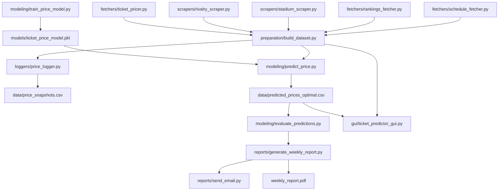

# 🏈 College Football Ticket Price Forecasting

This project forecasts college football ticket prices and identifies the **optimal time and date to purchase tickets** for any given game. It combines scraped game data, rankings, stadium info, rivalries, and pricing snapshots, and will evolve into a fully supervised machine learning pipeline.

---

## 🔧 Features

- ✅ **Enriched dataset builder**: pulls and merges game schedule, team rankings, venue size, rivalries, and pricing data  
- ⏱ **Scheduled price snapshots**: collects pricing data 4× daily  
- 📊 **Ranking fetcher**: fetches AP/Playoff rankings (with fallback to Wikipedia)  
- 🧠 **ML model**: predicts lowest ticket price using RandomForest  
- 🔍 **Optimal purchase time estimator**: simulates price predictions at all (date, time) combinations pre-game  
- 📈 **Feature importance visualization**  
- 🔁 **Postseason retraining plan**: build supervised models on true pricing outcomes  

---

## 📁 Project Structure


```
cfb-ticket-model/
├── data/                        # Pricing snapshots, enriched schedule
├── models/                      # Trained model artifacts
├── src/
│   ├── fetchers/
│   │   ├── rankings_fetcher.py      # Ranking puller (CFD + Wikipedia)
│   │   ├── schedule_fetcher.py      # Game schedule puller
│   │   └── ticket_pricer.py         # Live/mock pricing logic
│   ├── scrapers/
│   │   ├── rivalry_scraper.py       # Known rivalries
│   │   └── stadium_scraper.py       # Venue capacity info
│   ├── preparation/
│   │   └── build_dataset.py         # Build enriched schedule
│   ├── loggers/
│   │   └── price_logger.py          # Collect ticket prices 4× daily
│   ├── modeling/
│   │   ├── train_price_model.py     # Train ML model
│   │   ├── predict_price.py         # Predict prices for all games
│   │   └── evaluate_predictions.py  # Compare predicted vs actual prices
│   ├── reports/
│   │   ├── generate_weekly_report.py  # Summarize model accuracy + insights
│   │   └── send_email.py              # Email the report to stakeholders
│   ├── gui/
│   │   └── ticket_predictor_gui.py    # GUI to select teams and view predictions
│   └── __init__.py
├── .env                        # API keys and environment settings
├── requirements.txt            # Python dependencies
└── README.md                   # You are here
```

---


## 🔄 Project Flow

### Flow
Build_Dataset <
1. Schedule_fetcher
2. Rankings_fetcher
3. Rivalry_scraper
4. Stadium_scraper
5. Ticket_pricer <
  5a. Fetch_ncaa_events (dependent on schedule_fetcher)

<details>
<summary>Click to view Mermaid diagram</summary>



</details>


## ⚙️ Setup

1. Clone the repo:

```bash
git clone https://github.com/YOUR_USERNAME/cfb-ticket-model.git
cd cfb-ticket-model
```

2. Create your `.env` file:

```
CFD_API_KEY=your_cfd_api_key
SEATGEEK_CLIENT_ID=your_seatgeek_id
SEATGEEK_CLIENT_SECRET=your_seatgeek_secret
```

3. Install dependencies:

```bash
pip install -r requirements.txt
```

4. Run the pipeline (in order):

```bash
python src/preparation/build_dataset.py
python src/loggers/price_logger.py
python src/modeling/train_price_model.py
python src/modeling/predict_price.py
```

---

## 📆 Cron Schedule (Recommended)

```cron
# Rankings - Mon/Wed at 7am
0 7 * * 1,3 /usr/bin/python3 /full/path/to/src/fetchers/rankings_fetcher.py

# Prices - 4× daily
0 6,12,18,0 * * * /usr/bin/python3 /full/path/to/src/loggers/price_logger.py
```

---

## 🧠 Future Plans

- Use actual pricing outcomes after each game to retrain the model  
- Expand predictions to group pricing and listing counts  
- Build a dashboard to visualize price forecasts and buy recommendations  

---

## 🤝 Contributing

If you're passionate about sports analytics or modeling dynamic prices, feel free to submit PRs or ideas!

---

## 📄 License

@RandiSims2025
```