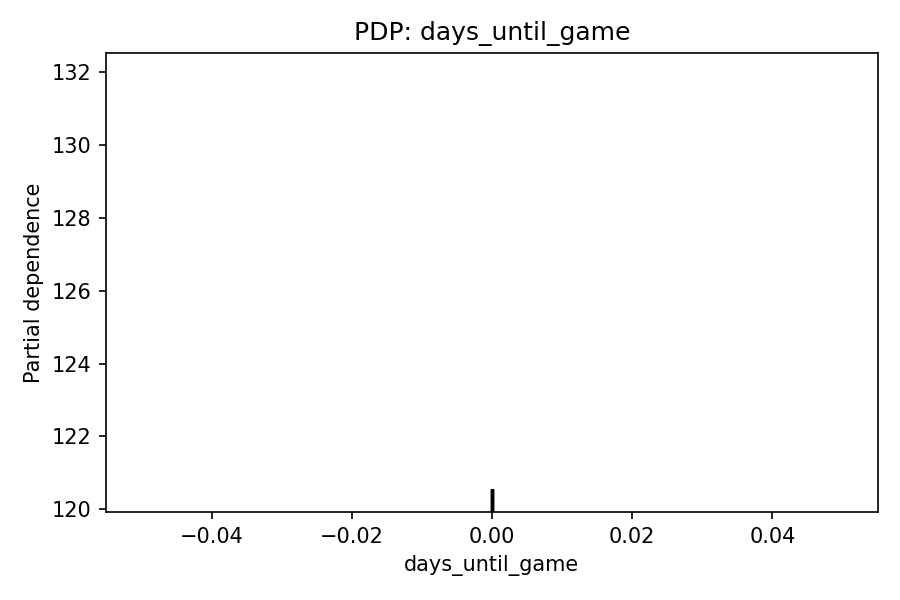
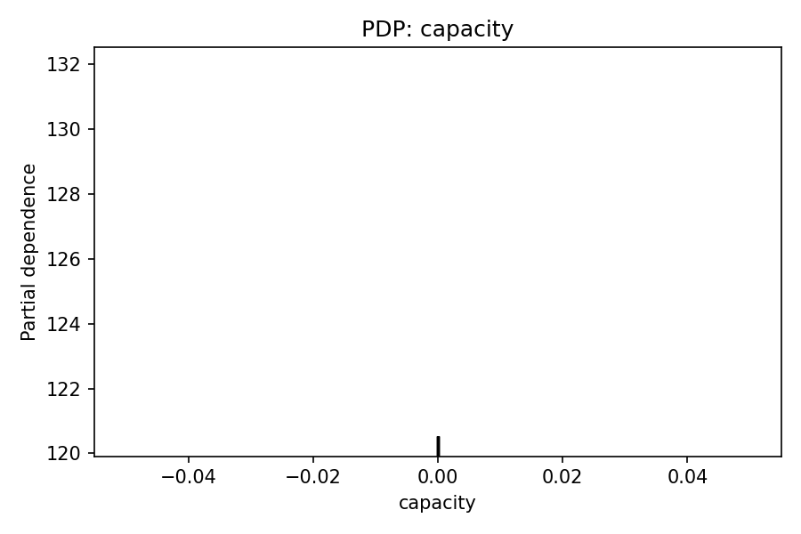
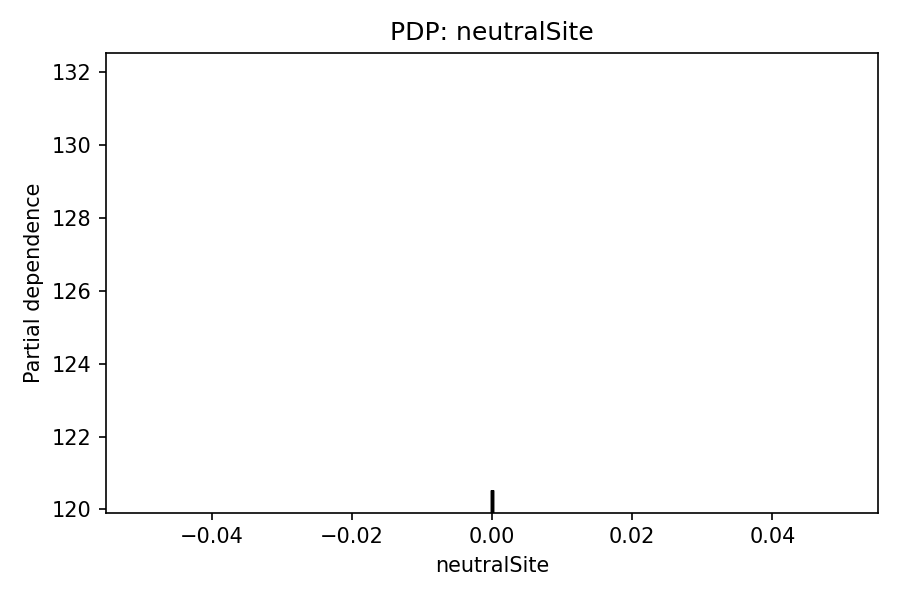
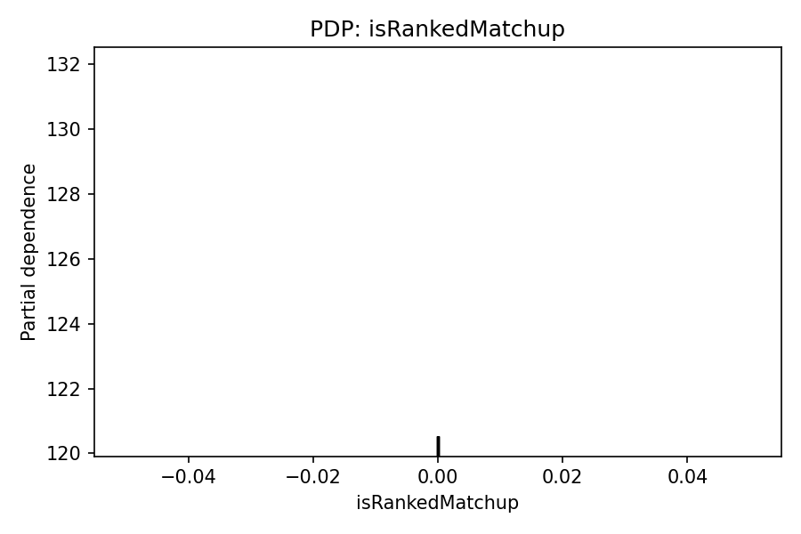
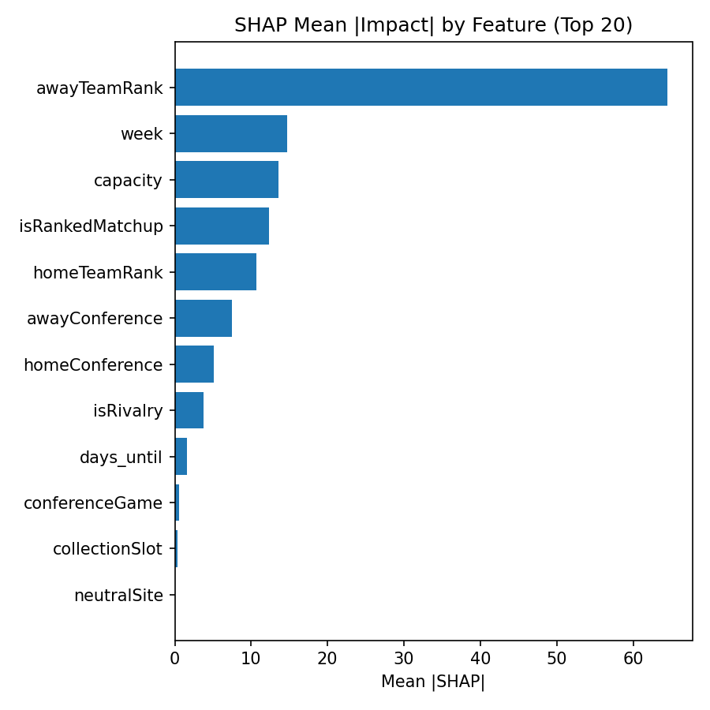
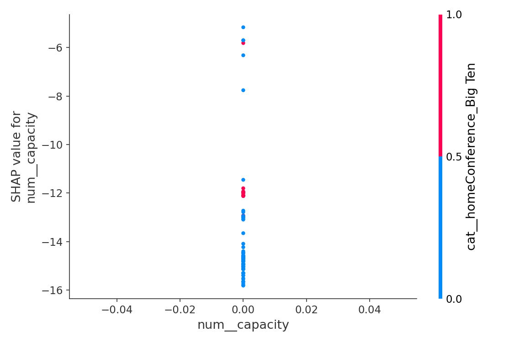
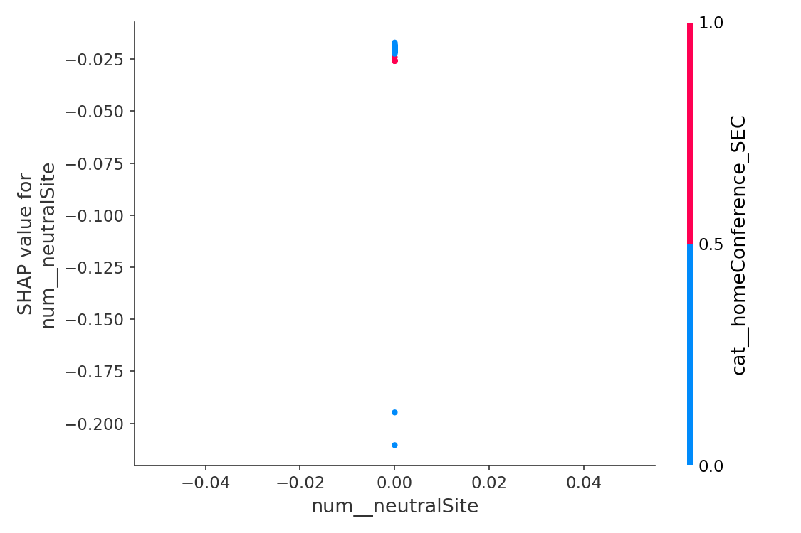
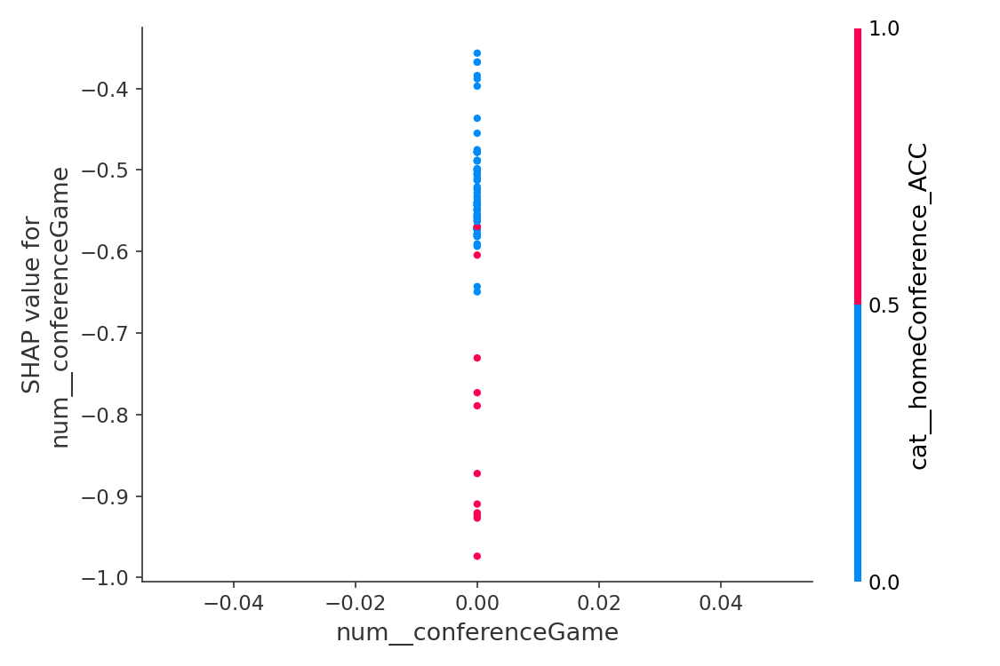
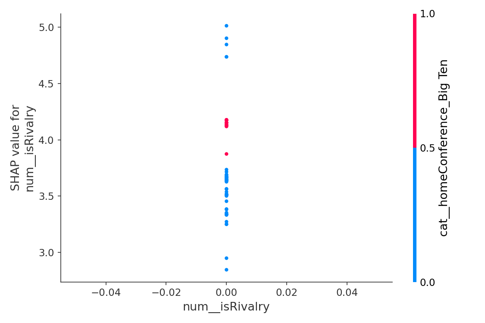
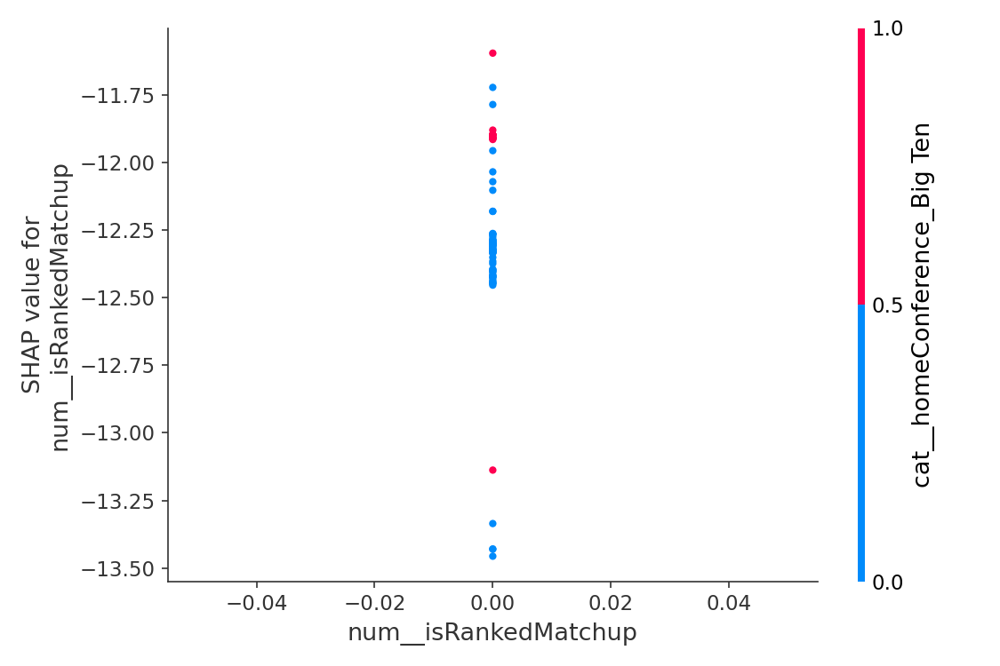

# 📈 Weekly Ticket Price Model Report
**Date:** 2025-09-02

## 🔍 Best Predictors of Ticket Price

### Top Transformed Features (expanded)
- isRankedMatchup was important, contributing 31.8% to predictions.
- capacity was important, contributing 15.4% to predictions.
- awayTeamRank was important, contributing 15.3% to predictions.
- week was important, contributing 8.5% to predictions.
- homeTeamRank was important, contributing 8.3% to predictions.
- days until game was important, contributing 7.1% to predictions.
- isRivalry was important, contributing 3.7% to predictions.
- Teams from the Big Ten awayconference mattered, contributing 1.7%.
- Teams from the SEC awayconference mattered, contributing 1.6%.
- Teams from the Big 12 awayconference mattered, contributing 1.5%.
- conferenceGame was important, contributing 0.8% to predictions.
- Teams from the ACC awayconference mattered, contributing 0.7%.
- Teams from the Big 12 homeconference mattered, contributing 0.6%.
- Teams from the SEC homeconference mattered, contributing 0.3%.
- Teams from the American Athletic homeconference mattered, contributing 0.3%.
- Teams from the Big Ten homeconference mattered, contributing 0.3%.
- Teams from the ACC homeconference mattered, contributing 0.2%.
- Teams from the Sun Belt homeconference mattered, contributing 0.2%.
- Teams from the Mountain West awayconference mattered, contributing 0.2%.
- Teams from the Mid-American awayconference mattered, contributing 0.2%.

### Aggregated by Original Column
- isRankedMatchup: 0.3178
- capacity: 0.1540
- awayTeamRank: 0.1527
- week: 0.0852
- homeTeamRank: 0.0826
- days_until: 0.0706
- awayConference: 0.0663
- isRivalry: 0.0368
- homeConference: 0.0231
- conferenceGame: 0.0079
- collectionSlot: 0.0021
- neutralSite: 0.0008

**Possibly unrelated (near-zero importance):** conferenceGame, collectionSlot, neutralSite

## 🧪 Permutation Importance (recent data)

Top features by mean importance:

- days_until_game: 0.000000 (±0.000000)
- capacity: 0.000000 (±0.000000)
- neutralSite: 0.000000 (±0.000000)
- conferenceGame: 0.000000 (±0.000000)
- isRivalry: 0.000000 (±0.000000)
- isRankedMatchup: 0.000000 (±0.000000)
- homeTeamRank: 0.000000 (±0.000000)
- awayTeamRank: 0.000000 (±0.000000)
- week: 0.000000 (±0.000000)
- collectionSlot: 0.000000 (±0.000000)
- homeConference: -0.006297 (±0.012832)
- awayConference: -0.034648 (±0.004689)

_Saved full table → `data/permutation_importance_2025-09-02.csv`_

## 📈 Partial Dependence (Top Perm-Important)

## 🧮 SHAP Diagnostics (Top Perm-Important)

- Aggregated mean |SHAP| table: `data/shap_2025-09-02_mean_abs_by_feature_2025-09-02.csv`

## 📊 Model Accuracy (Past 7 Days)

- Games evaluated: **92**
- MAE (price): **$4.86**
- RMSE (price): **$8.24**
- Games > 5% price error: **70 / 92**

### ⏱️ Timing Accuracy (Predicted Optimal vs Actual Lowest)
- MAE (hours): **107.78 h**  •  Median |Δ|: **24.00 h**
- Within 6h: **30/92**  •  Within 12h: **33/92**  •  Within 24h: **44/92**
- Bias: predictions are on average **106.42 h earlier than** actual lows

## 🎯 Predicted vs Actual Prices & Timing

| Game | Date (ET) | Pred $ | Actual $ | Abs $ | % Err | Pred Opt (ET) | Actual Low (ET) | Abs Δ (h) |
|------|--------------------|--------|----------|-------|-------|----------------------|-------------------------|-----------|
| ACC vs American Athletic | 2025-08-28 | $66.40 | $106.00 | $39.60 | 37.4% | 2025-08-05 18:00 | 2025-08-27 15:51 | 525.86 |
| American Athletic vs Southern | 2025-08-30 | $42.29 | $72.00 | $29.71 | 41.3% | 2025-08-01 06:00 | 2025-08-30 00:00 | 690.00 |
| Big 12 vs SEC | 2025-08-29 | $67.00 | $47.00 | $20.00 | 42.6% | 2025-08-28 18:00 | 2025-08-29 18:00 | 24.00 |
| Big 12 vs SWAC | 2025-08-30 | $22.54 | $41.00 | $18.46 | 45.0% | 2025-08-20 12:00 | 2025-08-30 00:00 | 228.00 |
| American Athletic vs Southern | 2025-08-30 | $42.29 | $24.00 | $18.29 | 76.2% | 2025-08-01 06:00 | 2025-08-30 06:00 | 696.00 |
| nan vs nan | 2025-09-01 | $42.65 | $59.00 | $16.35 | 27.7% | 2025-08-23 00:00 | 2025-09-01 00:00 | 216.00 |
| ACC vs SEC | 2025-08-30 | $291.10 | $275.00 | $16.10 | 5.9% | 2025-07-31 12:00 | 2025-08-28 18:00 | 678.00 |
| ACC vs SEC | 2025-08-30 | $175.96 | $160.00 | $15.96 | 10.0% | 2025-08-29 18:00 | 2025-08-30 06:00 | 12.00 |
| Mid-American vs Mountain West | 2025-08-28 | $28.70 | $13.00 | $15.70 | 120.8% | 2025-08-25 12:00 | 2025-08-28 18:00 | 78.00 |
| ACC vs NEC | 2025-08-30 | $27.70 | $15.00 | $12.70 | 84.7% | 2025-08-13 18:00 | 2025-08-24 01:06 | 247.10 |
| Big 12 vs Big Ten | 2025-08-28 | $66.70 | $55.00 | $11.70 | 21.3% | 2025-08-27 00:00 | 2025-08-28 13:50 | 37.83 |
| Big Ten vs SEC | 2025-08-30 | $232.70 | $221.00 | $11.70 | 5.3% | 2025-08-29 00:00 | 2025-08-28 18:00 | 6.00 |
| Big 12 vs Big Sky | 2025-08-30 | $57.39 | $69.00 | $11.61 | 16.8% | 2025-08-01 12:00 | 2025-08-24 01:06 | 541.10 |
| Sun Belt vs American Athletic | 2025-08-30 | $21.39 | $10.00 | $11.39 | 113.9% | 2025-08-29 18:00 | 2025-08-30 00:00 | 6.00 |
| Conference USA vs SWAC | 2025-08-29 | $22.25 | $11.00 | $11.25 | 102.3% | 2025-08-28 18:00 | 2025-08-29 18:00 | 24.00 |
| Big Ten vs American Athletic | 2025-08-30 | $9.24 | $18.00 | $8.76 | 48.7% | 2025-08-25 06:00 | 2025-08-30 00:00 | 114.00 |
| Big 12 vs NEC | 2025-08-30 | $25.50 | $17.00 | $8.50 | 50.0% | 2025-08-29 00:00 | 2025-08-30 12:00 | 36.00 |
| ACC vs FBS Independent | 2025-08-31 | $191.91 | $184.00 | $7.91 | 4.3% | 2025-08-30 06:00 | 2025-08-31 00:00 | 18.00 |
| Big Ten vs Big Sky | 2025-08-30 | $31.76 | $24.00 | $7.76 | 32.3% | 2025-08-23 06:00 | 2025-08-30 00:00 | 162.00 |
| Big Ten vs Mid-American | 2025-08-29 | $37.56 | $45.00 | $7.44 | 16.5% | 2025-08-18 06:00 | 2025-08-24 01:06 | 139.10 |
| Big Ten vs Big 12 | 2025-08-30 | $26.43 | $19.00 | $7.43 | 39.1% | 2025-08-29 12:00 | 2025-08-30 12:00 | 24.00 |
| SEC vs NEC | 2025-08-30 | $33.28 | $27.00 | $6.28 | 23.3% | 2025-08-29 00:00 | 2025-08-30 00:00 | 24.00 |
| Big Ten vs American Athletic | 2025-08-30 | $9.24 | $3.00 | $6.24 | 208.0% | 2025-08-25 06:00 | 2025-08-30 00:00 | 114.00 |
| Big Ten vs Sun Belt | 2025-08-30 | $22.97 | $17.00 | $5.97 | 35.1% | 2025-08-20 12:00 | 2025-08-30 12:00 | 240.00 |
| SEC vs American Athletic | 2025-08-30 | $53.86 | $48.00 | $5.86 | 12.2% | 2025-08-29 06:00 | 2025-08-30 06:00 | 24.00 |
| SEC vs ACC | 2025-08-30 | $51.49 | $46.00 | $5.49 | 11.9% | 2025-08-29 00:00 | 2025-08-30 00:00 | 24.00 |
| Mountain West vs Mid-American | 2025-08-29 | $16.39 | $11.00 | $5.39 | 49.0% | 2025-08-28 18:00 | 2025-08-29 18:00 | 24.00 |
| Conference USA vs UAC | 2025-08-30 | $17.48 | $13.00 | $4.48 | 34.5% | 2025-08-29 12:00 | 2025-08-29 18:00 | 6.00 |
| Sun Belt vs Southland | 2025-08-30 | $16.48 | $12.00 | $4.48 | 37.3% | 2025-08-29 18:00 | 2025-08-30 12:00 | 18.00 |
| Big Ten vs Mid-American | 2025-08-28 | $20.57 | $25.00 | $4.43 | 17.7% | 2025-08-18 00:00 | 2025-08-24 01:06 | 145.10 |
| Sun Belt vs Big South-OVC | 2025-08-30 | $16.14 | $12.00 | $4.14 | 34.5% | 2025-08-27 12:00 | 2025-08-27 14:44 | 2.75 |
| SEC vs Sun Belt | 2025-08-30 | $33.13 | $29.00 | $4.13 | 14.2% | 2025-08-28 06:00 | 2025-08-30 00:00 | 42.00 |
| American Athletic vs Southland | 2025-08-30 | $18.86 | $15.00 | $3.86 | 25.7% | 2025-08-29 18:00 | 2025-08-30 18:00 | 24.00 |
| Big 12 vs MVFC | 2025-08-30 | $33.62 | $30.00 | $3.62 | 12.1% | 2025-08-29 12:00 | 2025-08-30 12:00 | 24.00 |
| Big Ten vs Mid-American | 2025-08-28 | $20.57 | $17.00 | $3.57 | 21.0% | 2025-08-18 00:00 | 2025-08-27 14:44 | 230.75 |
| Big 12 vs Southland | 2025-08-28 | $16.62 | $20.00 | $3.38 | 16.9% | 2025-08-27 18:00 | 2025-08-28 18:00 | 24.00 |
| Big Ten vs Mid-American | 2025-08-28 | $15.37 | $12.00 | $3.37 | 28.1% | 2025-08-18 12:00 | 2025-08-28 18:00 | 246.00 |
| Sun Belt vs SEC | 2025-08-30 | $23.25 | $20.00 | $3.25 | 16.2% | 2025-08-29 18:00 | 2025-08-30 00:00 | 6.00 |
| American Athletic vs SWAC | 2025-08-28 | $28.11 | $25.00 | $3.11 | 12.4% | 2025-08-27 18:00 | 2025-08-27 15:51 | 2.14 |
| Big 12 vs ACC | 2025-08-29 | $121.01 | $124.00 | $2.99 | 2.4% | 2025-08-22 12:00 | 2025-08-28 06:00 | 138.00 |
| SEC vs UAC | 2025-08-28 | $17.94 | $15.00 | $2.94 | 19.6% | 2025-08-25 12:00 | 2025-08-24 01:06 | 34.90 |
| Conference USA vs Southland | 2025-08-30 | $17.86 | $15.00 | $2.86 | 19.1% | 2025-08-29 12:00 | 2025-08-30 12:00 | 24.00 |
| Big 12 vs Big Sky | 2025-08-30 | $12.82 | $10.00 | $2.82 | 28.2% | 2025-08-09 12:00 | 2025-08-24 01:06 | 349.10 |
| SEC vs Sun Belt | 2025-08-30 | $17.77 | $15.00 | $2.77 | 18.5% | 2025-08-29 18:00 | 2025-08-29 18:00 | 0.00 |
| Mountain West vs Patriot | 2025-08-30 | $20.41 | $18.00 | $2.41 | 13.4% | 2025-08-29 06:00 | 2025-08-30 06:00 | 24.00 |
| Conference USA vs Mountain West | 2025-08-29 | $19.18 | $17.00 | $2.18 | 12.8% | 2025-08-21 18:00 | 2025-08-29 18:00 | 192.00 |
| Sun Belt vs Big Sky | 2025-08-30 | $32.10 | $30.00 | $2.10 | 7.0% | 2025-08-29 18:00 | 2025-08-29 18:00 | 0.00 |
| Big Ten vs Mountain West | 2025-08-30 | $65.91 | $68.00 | $2.09 | 3.1% | 2025-08-23 00:00 | 2025-08-27 14:44 | 110.75 |
| SEC vs Mid-American | 2025-08-30 | $12.97 | $11.00 | $1.97 | 17.9% | 2025-08-29 18:00 | 2025-08-29 18:00 | 0.00 |
| Big 12 vs NEC | 2025-08-29 | $8.96 | $7.00 | $1.96 | 28.0% | 2025-08-28 00:00 | 2025-08-29 00:00 | 24.00 |
| Mid-American vs FCS Independent | 2025-08-30 | $9.83 | $8.00 | $1.83 | 22.9% | 2025-08-29 18:00 | 2025-08-30 06:00 | 12.00 |
| Mountain West vs CAA | 2025-08-28 | $21.61 | $20.00 | $1.61 | 8.0% | 2025-08-24 12:00 | 2025-08-24 01:06 | 10.90 |
| Mid-American vs Patriot | 2025-08-30 | $13.50 | $12.00 | $1.50 | 12.5% | 2025-08-29 18:00 | 2025-08-29 18:00 | 0.00 |
| Sun Belt vs NEC | 2025-08-28 | $15.54 | $17.00 | $1.46 | 8.6% | 2025-08-27 18:00 | 2025-08-27 15:51 | 2.14 |
| Mid-American vs American Athletic | 2025-08-30 | $15.38 | $14.00 | $1.38 | 9.9% | 2025-08-29 18:00 | 2025-08-29 18:00 | 0.00 |
| Big Ten vs Mid-American | 2025-08-30 | $9.37 | $8.00 | $1.37 | 17.1% | 2025-08-23 12:00 | 2025-08-24 01:06 | 13.10 |
| SEC vs Big South-OVC | 2025-08-30 | $6.33 | $5.00 | $1.33 | 26.6% | 2025-08-29 18:00 | 2025-08-30 06:00 | 12.00 |
| American Athletic vs Southern | 2025-08-30 | $13.26 | $12.00 | $1.26 | 10.5% | 2025-08-27 12:00 | 2025-08-27 14:44 | 2.75 |
| Conference USA vs UAC | 2025-08-30 | $7.17 | $6.00 | $1.17 | 19.5% | 2025-08-29 18:00 | 2025-08-29 18:00 | 0.00 |
| ACC vs UAC | 2025-08-30 | $7.17 | $6.00 | $1.17 | 19.5% | 2025-08-09 12:00 | 2025-08-24 01:06 | 349.10 |
| Big Ten vs Mountain West | 2025-08-30 | $8.09 | $7.00 | $1.09 | 15.6% | 2025-08-29 18:00 | 2025-08-30 12:00 | 18.00 |
| Mountain West vs Sun Belt | 2025-08-30 | $17.06 | $16.00 | $1.06 | 6.6% | 2025-08-29 00:00 | 2025-08-29 00:00 | 0.00 |
| Big 12 vs MVFC | 2025-08-30 | $20.02 | $19.00 | $1.02 | 5.4% | 2025-08-14 18:00 | 2025-08-28 18:00 | 336.00 |
| Conference USA vs CAA | 2025-08-30 | $23.92 | $23.00 | $0.92 | 4.0% | 2025-08-29 18:00 | 2025-08-30 12:00 | 18.00 |
| Sun Belt vs Mid-American | 2025-08-30 | $14.91 | $14.00 | $0.91 | 6.5% | 2025-08-28 06:00 | 2025-08-28 06:00 | 0.00 |
| Mountain West vs Conference USA | 2025-08-30 | $32.12 | $33.00 | $0.88 | 2.7% | 2025-08-08 06:00 | 2025-08-27 14:44 | 464.75 |
| Big 12 vs Mountain West | 2025-08-30 | $8.88 | $8.00 | $0.88 | 11.0% | 2025-08-27 18:00 | 2025-08-27 15:51 | 2.14 |
| Conference USA vs CAA | 2025-08-30 | $22.13 | $23.00 | $0.87 | 3.8% | 2025-08-20 18:00 | 2025-08-27 14:44 | 164.75 |
| Big Ten vs CAA | 2025-08-30 | $22.15 | $23.00 | $0.85 | 3.7% | 2025-08-19 18:00 | 2025-08-28 18:00 | 216.00 |
| ACC vs Southland | 2025-08-30 | $3.83 | $3.00 | $0.83 | 27.7% | 2025-08-29 12:00 | 2025-08-29 12:00 | 0.00 |
| SEC vs SWAC | 2025-08-30 | $8.76 | $8.00 | $0.76 | 9.5% | 2025-08-29 12:00 | 2025-08-30 12:00 | 24.00 |
| Big 12 vs Big South-OVC | 2025-08-28 | $13.72 | $13.00 | $0.72 | 5.5% | 2025-08-27 12:00 | 2025-08-27 14:44 | 2.75 |
| American Athletic vs UAC | 2025-08-30 | $11.68 | $11.00 | $0.68 | 6.2% | 2025-08-28 18:00 | 2025-08-28 18:00 | 0.00 |
| Big Ten vs Conference USA | 2025-08-30 | $13.65 | $13.00 | $0.65 | 5.0% | 2025-08-29 00:00 | 2025-08-29 00:00 | 0.00 |
| ACC vs Big 12 | 2025-09-01 | $68.60 | $68.00 | $0.60 | 0.9% | 2025-08-26 12:00 | 2025-08-27 14:44 | 26.75 |
| SEC vs MVFC | 2025-08-30 | $33.55 | $33.00 | $0.55 | 1.7% | 2025-08-27 18:00 | 2025-08-27 15:51 | 2.14 |
| ACC vs Conference USA | 2025-08-29 | $5.51 | $5.00 | $0.51 | 10.2% | 2025-08-28 12:00 | 2025-08-29 12:00 | 24.00 |
| Big Ten vs Mid-American | 2025-08-28 | $4.50 | $4.00 | $0.50 | 12.5% | 2025-08-27 12:00 | 2025-08-27 14:44 | 2.75 |
| ACC vs Sun Belt | 2025-08-30 | $7.37 | $7.00 | $0.37 | 5.3% | 2025-08-29 12:00 | 2025-08-29 12:00 | 0.00 |
| Sun Belt vs MEAC | 2025-08-30 | $22.70 | $23.00 | $0.30 | 1.3% | 2025-08-29 18:00 | 2025-08-30 00:00 | 6.00 |
| SEC vs ACC | 2025-08-31 | $30.23 | $30.00 | $0.23 | 0.8% | 2025-08-30 06:00 | 2025-08-30 06:00 | 0.00 |
| Mid-American vs Patriot | 2025-08-28 | $12.78 | $13.00 | $0.22 | 1.7% | 2025-08-03 18:00 | 2025-08-24 01:06 | 487.10 |
| Big 12 vs Conference USA | 2025-08-28 | $6.22 | $6.00 | $0.22 | 3.7% | 2025-08-27 12:00 | 2025-08-27 14:44 | 2.75 |
| American Athletic vs Mountain West | 2025-08-28 | $25.82 | $26.00 | $0.18 | 0.7% | 2025-08-16 18:00 | 2025-08-27 15:51 | 261.86 |
| American Athletic vs UAC | 2025-08-29 | $5.17 | $5.00 | $0.17 | 3.4% | 2025-08-28 06:00 | 2025-08-28 06:00 | 0.00 |
| American Athletic vs Big Ten | 2025-08-30 | $2.17 | $2.00 | $0.17 | 8.5% | 2025-08-27 06:00 | 2025-08-27 14:44 | 8.75 |
| FBS Independents vs NEC | 2025-08-30 | $11.83 | $12.00 | $0.17 | 1.4% | 2025-08-07 18:00 | 2025-08-24 01:06 | 391.10 |
| Big Ten vs Big South-OVC | 2025-08-29 | $3.12 | $3.00 | $0.12 | 4.0% | 2025-08-27 18:00 | 2025-08-27 15:51 | 2.14 |
| ACC vs CAA | 2025-08-28 | $11.12 | $11.00 | $0.12 | 1.1% | 2025-08-27 12:00 | 2025-08-27 14:44 | 2.75 |
| Pac-12 vs ACC | 2025-08-30 | $23.07 | $23.00 | $0.07 | 0.3% | 2025-08-16 12:00 | 2025-08-29 18:00 | 318.00 |
| Big Ten vs Mountain West | 2025-08-30 | $10.94 | $11.00 | $0.06 | 0.5% | 2025-08-23 00:00 | 2025-08-27 14:44 | 110.75 |
| ACC vs Patriot | 2025-08-30 | $2.02 | $2.00 | $0.02 | 1.0% | 2025-08-28 06:00 | 2025-08-28 06:00 | 0.00 |

## 💡 Suggestions
- Miss rate >40% this week; consider revisiting hyperparameters or adding interaction features.
- Consider adding: team momentum (last 2–3 games), previous-week result diff, rivalry strength score, and weather (temp/precip).
- Explore time-of-day effects more granularly (hour buckets) and weekday/weekend splits.
- Check stadium capacity normalization (capacity vs. sold % if/when available).
- Timing: 9% of predictions occur *after* the actual low — consider features about pre-game demand decay and listing churn.
- Near-zero importance this week (may be unrelated): collectionSlot, conferenceGame, neutralSite