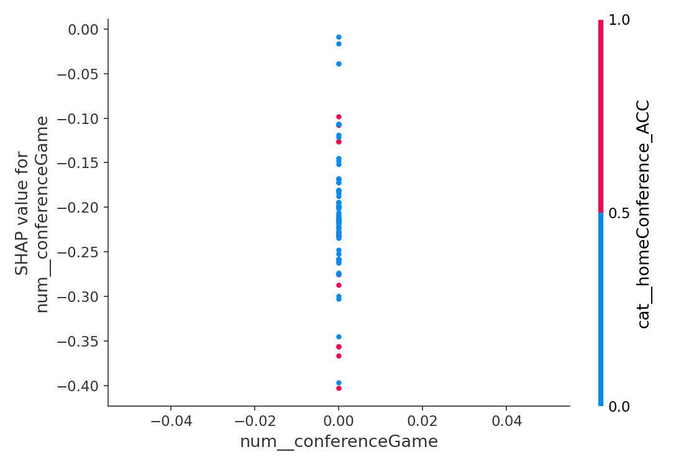

# 📈 Weekly Ticket Price Model Report
**Date:** 2025-09-05

## 🔍 Best Predictors of Ticket Price

### Top Transformed Features (expanded)
- isRankedMatchup was important, contributing 30.2% to predictions.
- capacity was important, contributing 16.4% to predictions.
- awayTeamRank was important, contributing 15.7% to predictions.
- week was important, contributing 10.7% to predictions.
- homeTeamRank was important, contributing 8.5% to predictions.
- days until game was important, contributing 4.6% to predictions.
- isRivalry was important, contributing 3.8% to predictions.
- Teams from the Big Ten awayconference mattered, contributing 1.7%.
- Teams from the Big 12 awayconference mattered, contributing 1.5%.
- Teams from the SEC awayconference mattered, contributing 1.4%.
- conferenceGame was important, contributing 0.9% to predictions.
- Teams from the ACC awayconference mattered, contributing 0.8%.
- Teams from the Big 12 homeconference mattered, contributing 0.6%.
- Teams from the SEC homeconference mattered, contributing 0.4%.
- Teams from the American Athletic homeconference mattered, contributing 0.3%.
- Teams from the ACC homeconference mattered, contributing 0.3%.
- Teams from the Sun Belt homeconference mattered, contributing 0.2%.
- Teams from the Big Ten homeconference mattered, contributing 0.2%.
- Teams from the Mid-American awayconference mattered, contributing 0.2%.
- Teams from the Mountain West awayconference mattered, contributing 0.2%.

### Aggregated by Original Column
- isRankedMatchup: 0.3018
- capacity: 0.1636
- awayTeamRank: 0.1572
- week: 0.1069
- homeTeamRank: 0.0848
- awayConference: 0.0659
- days_until: 0.0459
- isRivalry: 0.0378
- homeConference: 0.0241
- conferenceGame: 0.0086
- collectionSlot: 0.0019
- neutralSite: 0.0016

**Possibly unrelated (near-zero importance):** conferenceGame, collectionSlot, neutralSite

## 🧪 Permutation Importance (recent data)

Top features by mean importance:

- days_until_game: 0.000000 (±0.000000)
- capacity: 0.000000 (±0.000000)
- neutralSite: 0.000000 (±0.000000)
- conferenceGame: 0.000000 (±0.000000)
- isRivalry: 0.000000 (±0.000000)
- isRankedMatchup: 0.000000 (±0.000000)
- homeTeamRank: 0.000000 (±0.000000)
- awayTeamRank: 0.000000 (±0.000000)
- week: 0.000000 (±0.000000)
- collectionSlot: 0.000000 (±0.000000)
- homeConference: -0.003484 (±0.007977)
- awayConference: -0.037110 (±0.005609)

_Saved full table → `data/permutation_importance_2025-09-05.csv`_

## 📈 Partial Dependence (Top Perm-Important)

## 🧮 SHAP Diagnostics (Top Perm-Important)

- Aggregated mean |SHAP| table: `data/shap_2025-09-05_mean_abs_by_feature_2025-09-05.csv`

## 📊 Model Accuracy (Past 7 Days)

- Games evaluated: **75**
- MAE (price): **$4.26**
- RMSE (price): **$7.30**
- Games > 5% price error: **57 / 75**

### ⏱️ Timing Accuracy (Predicted Optimal vs Actual Lowest)
- MAE (hours): **77.36 h**  •  Median |Δ|: **24.00 h**
- Within 6h: **26/75**  •  Within 12h: **28/75**  •  Within 24h: **37/75**
- Bias: predictions are on average **69.82 h earlier than** actual lows

## 🎯 Predicted vs Actual Prices & Timing

| Game | Date (ET) | Pred $ | Actual $ | Abs $ | % Err | Pred Opt (ET) | Actual Low (ET) | Abs Δ (h) |
|------|--------------------|--------|----------|-------|-------|----------------------|-------------------------|-----------|
|  | 2025-08-30 | $32.65 | $72.00 | $39.35 | 54.7% | 2025-08-20 06:00 | 2025-08-30 00:00 | 234.00 |
|  | 2025-08-30 | $239.34 | $221.00 | $18.34 | 8.3% | 2025-08-29 00:00 | 2025-08-28 18:00 | 6.00 |
|  | 2025-08-30 | $24.71 | $41.00 | $16.29 | 39.7% | 2025-08-20 12:00 | 2025-08-30 00:00 | 228.00 |
|  | 2025-08-30 | $30.39 | $15.00 | $15.39 | 102.6% | 2025-08-29 18:00 | 2025-08-24 01:06 | 136.90 |
|  | 2025-08-29 | $60.01 | $47.00 | $13.01 | 27.7% | 2025-08-28 18:00 | 2025-08-29 18:00 | 24.00 |
|  | 2025-08-30 | $172.54 | $160.00 | $12.54 | 7.8% | 2025-08-29 18:00 | 2025-08-30 06:00 | 12.00 |
|  | 2025-08-30 | $20.05 | $8.00 | $12.05 | 150.6% | 2025-08-13 12:00 | 2025-08-30 12:00 | 408.00 |
|  | 2025-08-30 | $21.21 | $10.00 | $11.21 | 112.1% | 2025-08-29 18:00 | 2025-08-30 00:00 | 6.00 |
|  | 2025-08-30 | $285.97 | $275.00 | $10.97 | 4.0% | 2025-08-28 18:00 | 2025-08-28 18:00 | 0.00 |
|  | 2025-08-30 | $12.47 | $3.00 | $9.47 | 315.7% | 2025-08-24 00:00 | 2025-08-30 00:00 | 144.00 |
|  | 2025-08-30 | $25.66 | $17.00 | $8.66 | 50.9% | 2025-08-29 00:00 | 2025-08-30 12:00 | 36.00 |
|  | 2025-08-30 | $32.65 | $24.00 | $8.65 | 36.0% | 2025-08-20 06:00 | 2025-08-30 06:00 | 240.00 |
|  | 2025-08-30 | $27.26 | $19.00 | $8.26 | 43.5% | 2025-08-29 18:00 | 2025-08-30 12:00 | 18.00 |
|  | 2025-08-31 | $191.90 | $184.00 | $7.90 | 4.3% | 2025-08-30 06:00 | 2025-08-31 00:00 | 18.00 |
|  | 2025-08-30 | $24.23 | $17.00 | $7.23 | 42.5% | 2025-08-25 12:00 | 2025-08-30 12:00 | 120.00 |
|  | 2025-08-29 | $18.17 | $11.00 | $7.17 | 65.2% | 2025-08-28 18:00 | 2025-08-29 18:00 | 24.00 |
|  | 2025-08-30 | $52.94 | $46.00 | $6.94 | 15.1% | 2025-08-29 00:00 | 2025-08-30 00:00 | 24.00 |
|  | 2025-08-30 | $19.76 | $13.00 | $6.76 | 52.0% | 2025-08-26 12:00 | 2025-08-29 18:00 | 78.00 |
|  | 2025-08-30 | $33.23 | $27.00 | $6.23 | 23.1% | 2025-08-28 06:00 | 2025-08-30 00:00 | 42.00 |
|  | 2025-08-29 | $17.05 | $11.00 | $6.05 | 55.0% | 2025-08-28 18:00 | 2025-08-29 18:00 | 24.00 |
|  | 2025-08-30 | $53.53 | $48.00 | $5.53 | 11.5% | 2025-08-29 06:00 | 2025-08-30 06:00 | 24.00 |
|  | 2025-08-30 | $12.47 | $18.00 | $5.53 | 30.7% | 2025-08-24 00:00 | 2025-08-30 00:00 | 144.00 |
|  | 2025-09-01 | $53.76 | $59.00 | $5.24 | 8.9% | 2025-08-19 18:00 | 2025-09-01 00:00 | 294.00 |
|  | 2025-08-30 | $34.63 | $30.00 | $4.63 | 15.4% | 2025-08-28 12:00 | 2025-08-30 12:00 | 48.00 |
|  | 2025-08-30 | $32.84 | $29.00 | $3.84 | 13.2% | 2025-08-28 06:00 | 2025-08-30 00:00 | 42.00 |
|  | 2025-08-30 | $23.40 | $20.00 | $3.40 | 17.0% | 2025-08-29 18:00 | 2025-08-30 00:00 | 6.00 |
|  | 2025-08-30 | $13.25 | $10.00 | $3.25 | 32.5% | 2025-08-13 12:00 | 2025-08-24 01:06 | 253.10 |
|  | 2025-08-30 | $15.23 | $12.00 | $3.23 | 26.9% | 2025-08-29 18:00 | 2025-08-30 12:00 | 18.00 |
|  | 2025-08-30 | $20.93 | $18.00 | $2.93 | 16.3% | 2025-08-29 00:00 | 2025-08-30 06:00 | 30.00 |
|  | 2025-08-30 | $17.86 | $15.00 | $2.86 | 19.1% | 2025-08-29 18:00 | 2025-08-30 18:00 | 24.00 |
|  | 2025-08-30 | $17.75 | $15.00 | $2.75 | 18.3% | 2025-08-29 12:00 | 2025-08-30 12:00 | 24.00 |
|  | 2025-08-29 | $19.58 | $17.00 | $2.58 | 15.2% | 2025-08-28 18:00 | 2025-08-29 18:00 | 24.00 |
|  | 2025-08-30 | $14.40 | $12.00 | $2.40 | 20.0% | 2025-08-27 18:00 | 2025-08-27 15:51 | 2.14 |
|  | 2025-08-29 | $42.79 | $45.00 | $2.21 | 4.9% | 2025-08-15 00:00 | 2025-08-24 01:06 | 217.10 |
|  | 2025-08-30 | $17.14 | $15.00 | $2.14 | 14.3% | 2025-08-28 18:00 | 2025-08-29 18:00 | 24.00 |
|  | 2025-08-30 | $32.05 | $30.00 | $2.05 | 6.8% | 2025-08-29 18:00 | 2025-08-29 18:00 | 0.00 |
|  | 2025-08-30 | $12.87 | $11.00 | $1.87 | 17.0% | 2025-08-29 18:00 | 2025-08-29 18:00 | 0.00 |
|  | 2025-08-29 | $8.85 | $7.00 | $1.85 | 26.4% | 2025-08-28 18:00 | 2025-08-29 00:00 | 6.00 |
|  | 2025-08-30 | $21.16 | $23.00 | $1.84 | 8.0% | 2025-08-21 18:00 | 2025-08-27 14:44 | 140.75 |
|  | 2025-08-30 | $22.18 | $24.00 | $1.82 | 7.6% | 2025-08-20 18:00 | 2025-08-30 00:00 | 222.00 |
|  | 2025-08-30 | $9.81 | $8.00 | $1.81 | 22.6% | 2025-08-27 12:00 | 2025-08-24 01:06 | 82.90 |
|  | 2025-08-30 | $9.61 | $8.00 | $1.61 | 20.1% | 2025-08-29 18:00 | 2025-08-30 06:00 | 12.00 |
|  | 2025-08-30 | $31.46 | $33.00 | $1.54 | 4.7% | 2025-08-10 12:00 | 2025-08-27 14:44 | 410.75 |
|  | 2025-08-30 | $14.42 | $13.00 | $1.42 | 10.9% | 2025-08-29 18:00 | 2025-08-29 00:00 | 18.00 |
|  | 2025-08-30 | $13.31 | $12.00 | $1.31 | 10.9% | 2025-08-27 12:00 | 2025-08-27 14:44 | 2.75 |
|  | 2025-08-30 | $6.27 | $5.00 | $1.27 | 25.4% | 2025-08-28 06:00 | 2025-08-30 06:00 | 48.00 |
|  | 2025-08-30 | $7.25 | $6.00 | $1.25 | 20.8% | 2025-08-25 12:00 | 2025-08-24 01:06 | 34.90 |
|  | 2025-08-30 | $24.22 | $23.00 | $1.22 | 5.3% | 2025-08-28 18:00 | 2025-08-28 18:00 | 0.00 |
|  | 2025-08-30 | $17.21 | $16.00 | $1.21 | 7.6% | 2025-08-29 06:00 | 2025-08-29 06:00 | 0.00 |
|  | 2025-08-30 | $7.07 | $6.00 | $1.07 | 17.8% | 2025-08-29 18:00 | 2025-08-29 18:00 | 0.00 |
|  | 2025-08-30 | $20.05 | $19.00 | $1.05 | 5.5% | 2025-08-24 18:00 | 2025-08-28 18:00 | 96.00 |
|  | 2025-08-30 | $15.04 | $14.00 | $1.04 | 7.4% | 2025-08-28 06:00 | 2025-08-28 06:00 | 0.00 |
|  | 2025-08-30 | $12.98 | $12.00 | $0.98 | 8.2% | 2025-08-29 18:00 | 2025-08-29 18:00 | 0.00 |
|  | 2025-08-30 | $7.88 | $7.00 | $0.88 | 12.6% | 2025-08-29 18:00 | 2025-08-30 12:00 | 18.00 |
|  | 2025-08-30 | $68.14 | $69.00 | $0.86 | 1.2% | 2025-08-19 12:00 | 2025-08-24 01:06 | 109.10 |
|  | 2025-08-30 | $23.85 | $23.00 | $0.85 | 3.7% | 2025-08-01 12:00 | 2025-08-29 18:00 | 678.00 |
|  | 2025-08-30 | $8.73 | $8.00 | $0.73 | 9.1% | 2025-08-27 18:00 | 2025-08-27 15:51 | 2.14 |
|  | 2025-08-29 | $4.35 | $5.00 | $0.65 | 13.0% | 2025-08-28 00:00 | 2025-08-29 12:00 | 36.00 |
|  | 2025-08-30 | $11.64 | $11.00 | $0.64 | 5.8% | 2025-08-28 18:00 | 2025-08-28 18:00 | 0.00 |
|  | 2025-09-01 | $68.53 | $68.00 | $0.53 | 0.8% | 2025-08-27 12:00 | 2025-08-27 14:44 | 2.75 |
|  | 2025-08-30 | $14.52 | $14.00 | $0.52 | 3.7% | 2025-08-29 18:00 | 2025-08-29 18:00 | 0.00 |
|  | 2025-08-29 | $5.43 | $5.00 | $0.43 | 8.6% | 2025-08-28 06:00 | 2025-08-28 06:00 | 0.00 |
|  | 2025-08-30 | $7.38 | $7.00 | $0.38 | 5.4% | 2025-08-29 12:00 | 2025-08-29 12:00 | 0.00 |
|  | 2025-08-30 | $3.36 | $3.00 | $0.36 | 12.0% | 2025-08-29 00:00 | 2025-08-29 00:00 | 0.00 |
|  | 2025-08-29 | $123.66 | $124.00 | $0.34 | 0.3% | 2025-08-22 12:00 | 2025-08-28 06:00 | 138.00 |
|  | 2025-08-30 | $33.26 | $33.00 | $0.26 | 0.8% | 2025-08-27 12:00 | 2025-08-27 14:44 | 2.75 |
|  | 2025-08-29 | $3.24 | $3.00 | $0.24 | 8.0% | 2025-08-27 12:00 | 2025-08-27 14:44 | 2.75 |
|  | 2025-08-30 | $23.21 | $23.00 | $0.21 | 0.9% | 2025-08-29 18:00 | 2025-08-30 00:00 | 6.00 |
|  | 2025-08-31 | $30.20 | $30.00 | $0.20 | 0.7% | 2025-08-30 06:00 | 2025-08-30 06:00 | 0.00 |
|  | 2025-08-30 | $68.16 | $68.00 | $0.16 | 0.2% | 2025-08-14 06:00 | 2025-08-27 14:44 | 320.75 |
|  | 2025-08-30 | $12.12 | $12.00 | $0.12 | 1.0% | 2025-08-08 06:00 | 2025-08-24 01:06 | 379.10 |
|  | 2025-08-30 | $2.08 | $2.00 | $0.08 | 4.0% | 2025-08-28 00:00 | 2025-08-28 06:00 | 6.00 |
|  | 2025-08-30 | $11.05 | $11.00 | $0.05 | 0.5% | 2025-08-27 12:00 | 2025-08-27 14:44 | 2.75 |
|  | 2025-08-30 | $2.05 | $2.00 | $0.05 | 2.5% | 2025-08-27 06:00 | 2025-08-27 14:44 | 8.75 |
|  | 2025-08-30 | $23.03 | $23.00 | $0.03 | 0.1% | 2025-08-29 18:00 | 2025-08-30 12:00 | 18.00 |

## 💡 Suggestions
- Miss rate >40% this week; consider revisiting hyperparameters or adding interaction features.
- Consider adding: team momentum (last 2–3 games), previous-week result diff, rivalry strength score, and weather (temp/precip).
- Explore time-of-day effects more granularly (hour buckets) and weekday/weekend splits.
- Check stadium capacity normalization (capacity vs. sold % if/when available).
- Timing: 9% of predictions occur *after* the actual low — consider features about pre-game demand decay and listing churn.
- Near-zero importance this week (may be unrelated): collectionSlot, conferenceGame, neutralSite