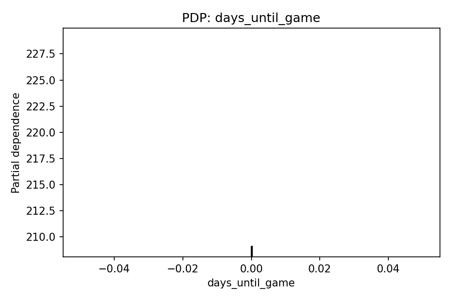
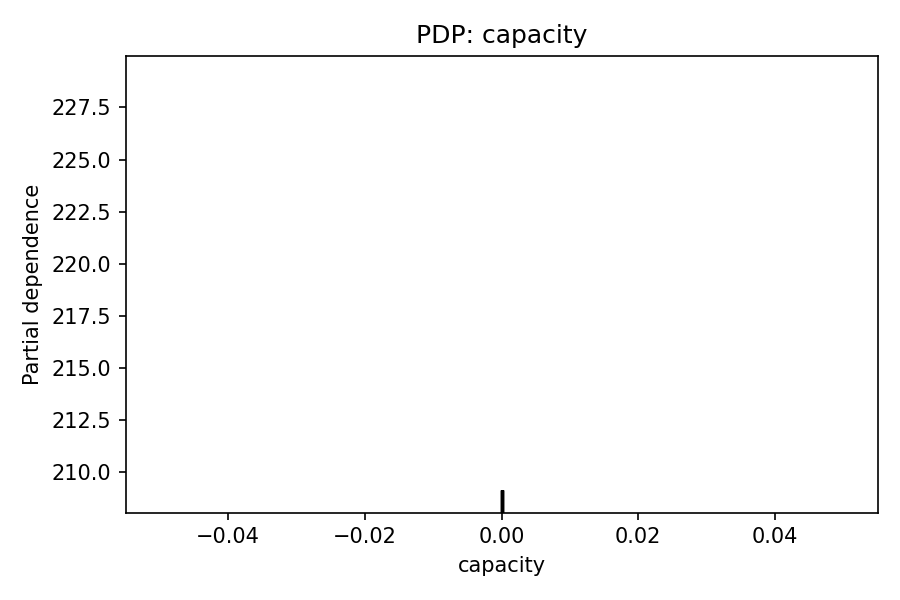
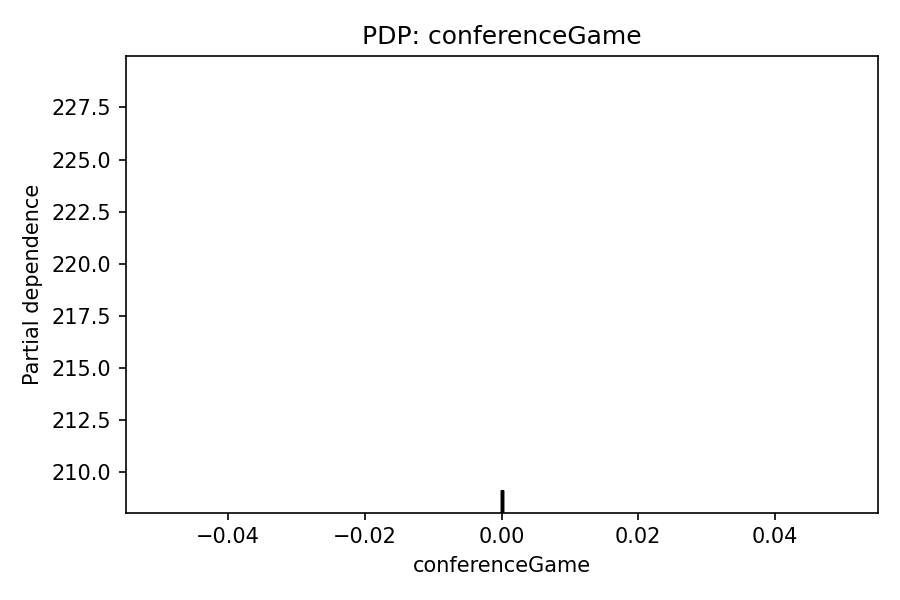

# 📈 Weekly Ticket Price Model Report
**Date:** 2025-09-14

## 🔍 Best Predictors of Ticket Price

### Top Transformed Features (expanded)
- days until game was important, contributing 34.0% to predictions.
- isRankedMatchup was important, contributing 21.0% to predictions.
- capacity was important, contributing 14.6% to predictions.
- week was important, contributing 9.1% to predictions.
- awayTeamRank was important, contributing 7.1% to predictions.
- isRivalry was important, contributing 2.5% to predictions.
- homeTeamRank was important, contributing 2.3% to predictions.
- collectionSlot 12:00 category influenced predictions (~1.9%).
- Teams from the Big Ten awayconference mattered, contributing 1.2%.
- Teams from the SEC awayconference mattered, contributing 1.1%.
- Teams from the Big 12 awayconference mattered, contributing 0.7%.
- conferenceGame was important, contributing 0.7% to predictions.
- neutralSite was important, contributing 0.5% to predictions.
- Teams from the SEC homeconference mattered, contributing 0.4%.
- Teams from the ACC awayconference mattered, contributing 0.4%.
- Teams from the Big 12 homeconference mattered, contributing 0.4%.
- Teams from the Mountain West awayconference mattered, contributing 0.3%.
- Teams from the American Athletic homeconference mattered, contributing 0.2%.
- collectionSlot 18:00 category influenced predictions (~0.2%).
- Teams from the ACC homeconference mattered, contributing 0.2%.

### Aggregated by Original Column
- days_until: 0.3405
- isRankedMatchup: 0.2102
- capacity: 0.1460
- week: 0.0908
- awayTeamRank: 0.0711
- awayConference: 0.0433
- isRivalry: 0.0246
- homeTeamRank: 0.0230
- collectionSlot: 0.0221
- homeConference: 0.0171
- conferenceGame: 0.0065
- neutralSite: 0.0048

**Possibly unrelated (near-zero importance):** conferenceGame, neutralSite

## 🧪 Permutation Importance (recent data)

Top features by mean importance:

- days_until_game: 0.000000 (±0.000000)
- capacity: 0.000000 (±0.000000)
- conferenceGame: 0.000000 (±0.000000)
- isRivalry: 0.000000 (±0.000000)
- homeTeamRank: 0.000000 (±0.000000)
- neutralSite: 0.000000 (±0.000000)
- isRankedMatchup: 0.000000 (±0.000000)
- awayTeamRank: 0.000000 (±0.000000)
- collectionSlot: 0.000000 (±0.000000)
- homeConference: -0.003243 (±0.002634)
- week: -0.005232 (±0.001856)
- awayConference: -0.038514 (±0.009113)

_Saved full table → `data/permutation_importance_2025-09-14.csv`_

## 📈 Partial Dependence (Top Perm-Important)

## 🧮 SHAP Diagnostics (Top Perm-Important)

- Aggregated mean |SHAP| table: `data/shap_2025-09-14_mean_abs_by_feature_2025-09-14.csv`

## 📊 Model Accuracy (Past 7 Days)

- Games evaluated: **72**
- MAE (price): **$10.32**
- RMSE (price): **$26.06**
- Games > 5% price error: **54 / 72**

### ⏱️ Timing Accuracy (Predicted Optimal vs Actual Lowest)
- MAE (hours): **82.04 h**  •  Median |Δ|: **22.39 h**
- Within 6h: **22/72**  •  Within 12h: **22/72**  •  Within 24h: **46/72**
- Bias: predictions are on average **59.01 h earlier than** actual lows

## 🎯 Predicted vs Actual Prices & Timing

| Game | Date (ET) | Pred $ | Actual $ | Abs $ | % Err | Pred Opt (ET) | Actual Low (ET) | Abs Δ (h) |
|------|--------------------|--------|----------|-------|-------|----------------------|-------------------------|-----------|

_Stopped table early: report time budget reached._

## 💡 Suggestions
- Miss rate >40% this week; consider revisiting hyperparameters or adding interaction features.
- Consider adding: team momentum (last 2–3 games), previous-week result diff, rivalry strength score, and weather (temp/precip).
- Explore time-of-day effects more granularly (hour buckets) and weekday/weekend splits.
- Check stadium capacity normalization (capacity vs. sold % if/when available).
- Timing: 15% of predictions occur *after* the actual low — consider features about pre-game demand decay and listing churn.
- Near-zero importance this week (may be unrelated): conferenceGame, neutralSite