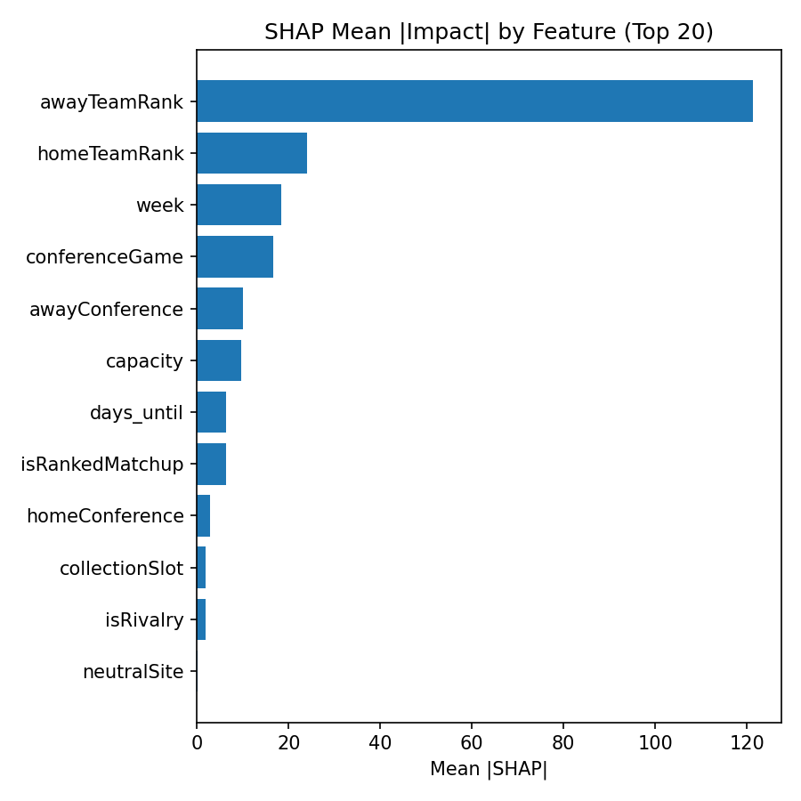
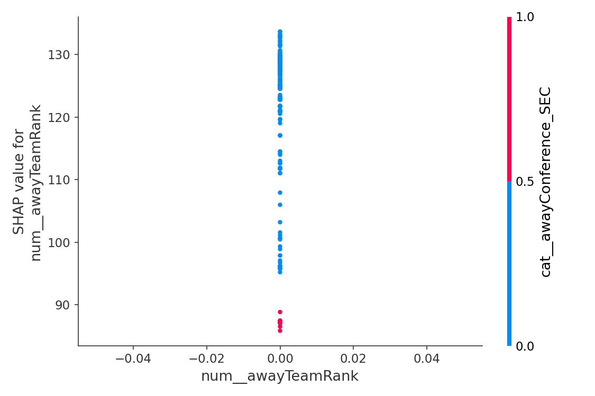
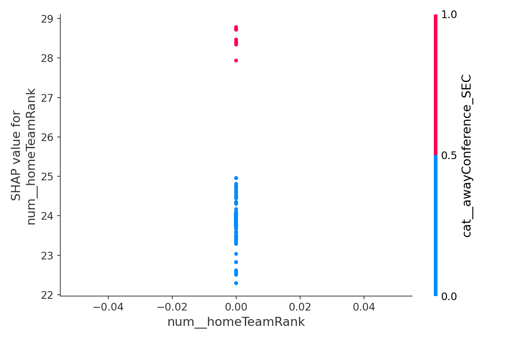

# 📈 Weekly Ticket Price Model Report
**Date:** 2025-09-14

## 🔍 Best Predictors of Ticket Price

### Top Transformed Features (expanded)
- days until game was important, contributing 37.3% to predictions.
- isRankedMatchup was important, contributing 20.0% to predictions.
- capacity was important, contributing 14.2% to predictions.
- week was important, contributing 8.6% to predictions.
- awayTeamRank was important, contributing 6.6% to predictions.
- isRivalry was important, contributing 2.3% to predictions.
- homeTeamRank was important, contributing 2.2% to predictions.
- collectionSlot 12:00 category influenced predictions (~1.6%).
- Teams from the Big Ten awayconference mattered, contributing 1.2%.
- Teams from the SEC awayconference mattered, contributing 1.1%.
- Teams from the Big 12 awayconference mattered, contributing 0.7%.
- neutralSite was important, contributing 0.6% to predictions.
- conferenceGame was important, contributing 0.6% to predictions.
- Teams from the ACC awayconference mattered, contributing 0.4%.
- Teams from the SEC homeconference mattered, contributing 0.4%.
- Teams from the Big 12 homeconference mattered, contributing 0.3%.
- Teams from the Mountain West awayconference mattered, contributing 0.3%.
- collectionSlot 18:00 category influenced predictions (~0.3%).
- Teams from the American Athletic homeconference mattered, contributing 0.2%.
- Teams from the Big Ten homeconference mattered, contributing 0.2%.

### Aggregated by Original Column
- days_until: 0.3726
- isRankedMatchup: 0.1997
- capacity: 0.1415
- week: 0.0861
- awayTeamRank: 0.0661
- awayConference: 0.0407
- isRivalry: 0.0232
- homeTeamRank: 0.0220
- collectionSlot: 0.0205
- homeConference: 0.0158
- neutralSite: 0.0061
- conferenceGame: 0.0056

**Possibly unrelated (near-zero importance):** neutralSite, conferenceGame

## 🧪 Permutation Importance (recent data)

Top features by mean importance:

- week: 0.002577 (±0.001030)
- awayTeamRank: 0.000000 (±0.000000)
- homeTeamRank: 0.000000 (±0.000000)
- neutralSite: 0.000000 (±0.000000)
- collectionSlot: 0.000000 (±0.000000)
- isRivalry: 0.000000 (±0.000000)
- days_until_game: 0.000000 (±0.000000)
- capacity: 0.000000 (±0.000000)
- conferenceGame: 0.000000 (±0.000000)
- isRankedMatchup: 0.000000 (±0.000000)
- homeConference: -0.003015 (±0.010001)
- awayConference: -0.036805 (±0.009843)

_Saved full table → `data/permutation_importance_2025-09-14.csv`_

## 📈 Partial Dependence (Top Perm-Important)

## 🧮 SHAP Diagnostics (Top Perm-Important)

- Aggregated mean |SHAP| table: `data/shap_2025-09-14_mean_abs_by_feature_2025-09-14.csv`

## 📊 Model Accuracy (Past 7 Days)

- Games evaluated: **72**
- MAE (price): **$8.36**
- RMSE (price): **$15.63**
- Games > 5% price error: **55 / 72**

### ⏱️ Timing Accuracy (Predicted Optimal vs Actual Lowest)
- MAE (hours): **97.81 h**  •  Median |Δ|: **22.39 h**
- Within 6h: **18/72**  •  Within 12h: **19/72**  •  Within 24h: **42/72**
- Bias: predictions are on average **62.05 h earlier than** actual lows

## 🎯 Predicted vs Actual Prices & Timing

| Game | Date (ET) | Pred $ | Actual $ | Abs $ | % Err | Pred Opt (ET) | Actual Low (ET) | Abs Δ (h) |
|------|--------------------|--------|----------|-------|-------|----------------------|-------------------------|-----------|
| Notre Dame Fighting Irish vs Texas A&M Aggie | 2025-09-13 | $197.20 | $130.00 | $67.20 | 51.7% | 2025-09-10 18:00 | 2025-09-13 10:23 | 64.39 |
| Northwestern Wildcats vs Oregon Duck | 2025-09-13 | $166.63 | $103.00 | $63.63 | 61.8% | 2025-09-12 18:00 | 2025-09-13 10:23 | 16.39 |
| Mississippi Rebels vs Arkansas Razorback | 2025-09-13 | $17.22 | $61.00 | $43.78 | 71.8% | 2025-09-08 00:00 | 2025-09-13 10:23 | 130.39 |
| West Virginia Mountaineers vs Pittsburgh Panther | 2025-09-13 | $166.56 | $129.00 | $37.56 | 29.1% | 2025-09-12 18:00 | 2025-09-13 10:23 | 16.39 |
| LSU Tigers vs Florida Gator | 2025-09-13 | $99.35 | $68.00 | $31.35 | 46.1% | 2025-09-09 00:00 | 2025-09-13 10:23 | 106.39 |
| Alabama Crimson Tide vs Wisconsin Badger | 2025-09-13 | $32.60 | $6.00 | $26.60 | 443.3% | 2025-09-11 12:00 | 2025-09-13 10:23 | 46.39 |
| Wyoming Cowboys vs Utah Ute | 2025-09-13 | $70.39 | $45.00 | $25.39 | 56.4% | 2025-09-12 18:00 | 2025-09-13 10:23 | 16.39 |
| Ohio State Buckeyes vs Ohio Bobcat | 2025-09-13 | $94.41 | $74.00 | $20.41 | 27.6% | 2025-08-30 06:00 | 2025-09-06 06:00 | 168.00 |
| Auburn Tigers vs South Alabama Jaguar | 2025-09-13 | $48.66 | $30.00 | $18.66 | 62.2% | 2025-08-24 18:00 | 2025-09-13 10:23 | 472.39 |
| Tennessee Volunteers vs Georgia Bulldog | 2025-09-13 | $311.51 | $293.00 | $18.51 | 6.3% | 2025-08-28 06:00 | 2025-08-28 06:00 | 0.00 |
| Fresno State Bulldogs vs Southern Jaguar | 2025-09-13 | $30.60 | $14.00 | $16.60 | 118.6% | 2025-09-04 18:00 | 2025-08-30 12:00 | 126.00 |
| Missouri Tigers vs Louisiana Lafayette Ragin Cajun | 2025-09-13 | $34.94 | $19.00 | $15.94 | 83.9% | 2025-09-12 12:00 | 2025-09-13 10:23 | 22.39 |
| Texas Longhorns vs UTEP Miner | 2025-09-13 | $54.75 | $39.00 | $15.75 | 40.4% | 2025-09-12 18:00 | 2025-09-13 10:23 | 16.39 |
| Coastal Carolina Chanticleers vs East Carolina Pirate | 2025-09-13 | $54.98 | $40.00 | $14.98 | 37.4% | 2025-09-12 12:00 | 2025-09-13 10:23 | 22.39 |
| South Carolina Gamecocks vs Vanderbilt Commodore | 2025-09-13 | $113.23 | $101.00 | $12.23 | 12.1% | 2025-09-12 00:00 | 2025-09-13 10:23 | 34.39 |
| Nebraska Cornhuskers vs Houston Christian Huskie | 2025-09-13 | $18.63 | $7.00 | $11.63 | 166.1% | 2025-08-22 00:00 | 2025-09-13 10:23 | 538.39 |
| Michigan Wolverines vs Central Michigan Chippewa | 2025-09-13 | $75.99 | $66.00 | $9.99 | 15.1% | 2025-09-12 12:00 | 2025-09-13 10:23 | 22.39 |
| Michigan State Spartans vs Youngstown State Penguin | 2025-09-13 | $44.88 | $35.00 | $9.88 | 28.2% | 2025-09-12 12:00 | 2025-09-13 10:23 | 22.39 |
| Ohio State Buckeyes vs Ohio Bobcat | 2025-09-13 | $84.25 | $93.00 | $8.75 | 9.4% | 2025-08-16 06:00 | 2025-09-08 18:00 | 564.00 |
| Illinois Fighting Illini vs Western Michigan Bronco | 2025-09-13 | $23.83 | $16.00 | $7.83 | 48.9% | 2025-08-27 12:00 | 2025-09-13 10:23 | 406.39 |
| Arkansas State Red Wolves vs Iowa State Cyclone | 2025-09-13 | $34.79 | $27.00 | $7.79 | 28.9% | 2025-09-12 18:00 | 2025-09-13 10:23 | 16.39 |
| Texas Tech Red Raiders vs Oregon State Beaver | 2025-09-13 | $27.66 | $20.00 | $7.66 | 38.3% | 2025-09-12 12:00 | 2025-09-13 10:23 | 22.39 |
| Missouri State Bears vs Southern Methodist (SMU) Mustang | 2025-09-13 | $28.59 | $21.00 | $7.59 | 36.1% | 2025-09-06 12:00 | 2025-09-06 00:00 | 12.00 |
| Iowa Hawkeyes vs UMass Minutemen | 2025-09-13 | $20.26 | $13.00 | $7.26 | 55.8% | 2025-09-12 18:00 | 2025-09-13 10:23 | 16.39 |
| Florida International Panthers vs Florida Atlantic Owl | 2025-09-13 | $23.18 | $16.00 | $7.18 | 44.9% | 2025-09-07 06:00 | 2025-09-13 10:23 | 148.39 |
| Temple Owls vs Oklahoma Sooner | 2025-09-13 | $23.18 | $30.00 | $6.82 | 22.7% | 2025-09-07 06:00 | 2025-09-13 10:23 | 148.39 |
| TCU Horned Frogs vs Abilene Christian Wildcat | 2025-09-13 | $34.49 | $28.00 | $6.49 | 23.2% | 2025-09-12 00:00 | 2025-09-13 10:23 | 34.39 |
| Cincinnati Bearcats vs Northwestern State Demon | 2025-09-13 | $15.34 | $9.00 | $6.34 | 70.4% | 2025-09-09 00:00 | 2025-09-13 10:23 | 106.39 |
| Hawaii Rainbow Warriors vs Portland State Viking | 2025-09-13 | $30.06 | $24.00 | $6.06 | 25.2% | 2025-09-12 00:00 | 2025-08-24 01:06 | 454.90 |
| Kennesaw State Owls vs Merrimack Warrior | 2025-09-13 | $15.44 | $21.00 | $5.56 | 26.5% | 2025-09-12 18:00 | 2025-09-13 10:23 | 16.39 |
| Arizona State Sun Devils vs Texas State Bobcat | 2025-09-13 | $10.56 | $5.00 | $5.56 | 111.2% | 2025-09-10 00:00 | 2025-08-28 18:00 | 294.00 |
| Rice Owls vs Prairie View A&M Panther | 2025-09-13 | $17.46 | $13.00 | $4.46 | 34.3% | 2025-09-12 18:00 | 2025-09-13 10:23 | 16.39 |
| Baylor Bears vs Samford Bulldog | 2025-09-13 | $15.17 | $11.00 | $4.17 | 37.9% | 2025-09-12 12:00 | 2025-09-13 10:23 | 22.39 |
| North Carolina Tar Heels vs Richmond Spider | 2025-09-13 | $37.13 | $34.00 | $3.13 | 9.2% | 2025-09-12 12:00 | 2025-09-13 10:23 | 22.39 |
| California Golden Bears vs Minnesota Golden Gopher | 2025-09-13 | $22.92 | $20.00 | $2.92 | 14.6% | 2025-09-12 00:00 | 2025-09-13 10:23 | 34.39 |
| UAB Blazers vs Akron Zip | 2025-09-13 | $15.62 | $13.00 | $2.62 | 20.2% | 2025-09-12 12:00 | 2025-09-13 10:23 | 22.39 |
| Bowling Green State Falcons vs Liberty Flame | 2025-09-13 | $25.61 | $28.00 | $2.39 | 8.5% | 2025-08-14 12:00 | 2025-08-27 14:44 | 314.75 |
| North Texas Mean Green vs Washington State Cougar | 2025-09-13 | $19.35 | $17.00 | $2.35 | 13.8% | 2025-09-12 18:00 | 2025-09-13 10:23 | 16.39 |
| Utah State Aggies vs Air Force Falcon | 2025-09-13 | $30.26 | $28.00 | $2.26 | 8.1% | 2025-09-12 12:00 | 2025-09-13 10:23 | 22.39 |
| Arizona Wildcats vs Kansas State Wildcat | 2025-09-12 | $11.24 | $9.00 | $2.24 | 24.9% | 2025-08-30 18:00 | 2025-09-06 00:00 | 150.00 |
| Louisiana Tech Bulldogs vs New Mexico State Aggie | 2025-09-13 | $18.17 | $16.00 | $2.17 | 13.6% | 2025-09-12 12:00 | 2025-09-13 10:23 | 22.39 |
| Tulsa Golden Hurricane vs Navy Midshipmen | 2025-09-13 | $16.16 | $14.00 | $2.16 | 15.4% | 2025-08-31 12:00 | 2025-09-13 10:23 | 310.39 |
| Marshall Thundering Herd vs Eastern Kentucky Colonel | 2025-09-13 | $14.07 | $12.00 | $2.07 | 17.2% | 2025-09-06 00:00 | 2025-09-09 12:00 | 84.00 |
| Troy Trojans vs Memphis Tiger | 2025-09-13 | $12.01 | $10.00 | $2.01 | 20.1% | 2025-09-09 00:00 | 2025-09-13 10:23 | 106.39 |
| Mississippi State Bulldogs vs Alcorn State Brave | 2025-09-13 | $7.91 | $6.00 | $1.91 | 31.8% | 2025-08-25 06:00 | 2025-08-30 00:00 | 114.00 |
| Purdue Boilermakers vs USC Trojan | 2025-09-13 | $18.61 | $17.00 | $1.61 | 9.5% | 2025-08-27 12:00 | 2025-08-27 14:44 | 2.75 |
| Ball State Cardinals vs New Hampshire Wildcat | 2025-09-13 | $16.58 | $15.00 | $1.58 | 10.5% | 2025-09-09 00:00 | 2025-09-09 00:00 | 0.00 |
| UTSA Roadrunners vs Incarnate Word Cardinal | 2025-09-13 | $16.52 | $15.00 | $1.52 | 10.1% | 2025-09-08 18:00 | 2025-09-08 18:00 | 0.00 |
| Georgia State Panthers vs Murray State Racer | 2025-09-13 | $7.29 | $6.00 | $1.29 | 21.5% | 2025-09-06 00:00 | 2025-09-06 00:00 | 0.00 |
| Indiana Hoosiers vs Indiana State Sycamore | 2025-09-12 | $22.12 | $21.00 | $1.12 | 5.3% | 2025-08-27 12:00 | 2025-09-07 00:00 | 252.00 |
| Stanford Cardinal vs Boston College Eagle | 2025-09-13 | $4.03 | $3.00 | $1.03 | 34.3% | 2025-09-07 06:00 | 2025-08-24 01:06 | 340.90 |
| Penn State Nittany Lions vs Villanova Wildcat | 2025-09-13 | $34.89 | $34.00 | $0.89 | 2.6% | 2025-08-25 06:00 | 2025-09-10 00:00 | 378.00 |
| Kentucky Wildcats vs Eastern Michigan Eagle | 2025-09-13 | $17.70 | $17.00 | $0.70 | 4.1% | 2025-09-10 18:00 | 2025-09-10 00:00 | 18.00 |
| Georgia Southern Eagles vs Jacksonville State Gamecock | 2025-09-13 | $28.45 | $29.00 | $0.55 | 1.9% | 2025-08-15 06:00 | 2025-08-24 01:06 | 211.10 |
| Maryland Terrapins vs Towson Tiger | 2025-09-13 | $2.45 | $3.00 | $0.55 | 18.3% | 2025-08-31 00:00 | 2025-09-05 10:43 | 130.73 |
| Houston Cougars vs Colorado Buffaloe | 2025-09-12 | $52.55 | $53.00 | $0.45 | 0.8% | 2025-08-15 06:00 | 2025-08-28 06:00 | 312.00 |
| Maryland Terrapins vs Towson Tiger | 2025-09-13 | $2.45 | $2.00 | $0.45 | 22.5% | 2025-08-31 00:00 | 2025-08-31 00:00 | 0.00 |
| Virginia Tech Hokies vs Old Dominion Monarch | 2025-09-13 | $8.43 | $8.00 | $0.43 | 5.4% | 2025-09-06 06:00 | 2025-09-06 06:00 | 0.00 |
| Charlotte 49ers vs Monmouth Hawk | 2025-09-13 | $5.40 | $5.00 | $0.40 | 8.0% | 2025-09-08 18:00 | 2025-09-08 18:00 | 0.00 |
| Georgia Tech Yellow Jackets vs Clemson Tiger | 2025-09-13 | $66.64 | $67.00 | $0.36 | 0.5% | 2025-08-22 00:00 | 2025-08-21 18:26 | 5.57 |
| Toledo Rockets vs Morgan State Bear | 2025-09-13 | $18.34 | $18.00 | $0.34 | 1.9% | 2025-09-05 18:00 | 2025-09-05 18:00 | 0.00 |
| Kent State Golden Flashes vs Buffalo Bull | 2025-09-13 | $14.29 | $14.00 | $0.29 | 2.1% | 2025-09-08 12:00 | 2025-09-08 12:00 | 0.00 |
| Nevada Wolf Pack vs Middle Tennessee Blue Raider | 2025-09-13 | $11.19 | $11.00 | $0.19 | 1.7% | 2025-09-09 18:00 | 2025-09-09 18:00 | 0.00 |
| UCLA Bruins vs New Mexico Lobo | 2025-09-12 | $6.17 | $6.00 | $0.17 | 2.8% | 2025-09-10 18:00 | 2025-09-10 00:00 | 18.00 |
| Miami Hurricanes vs South Florida Bull | 2025-09-13 | $9.16 | $9.00 | $0.16 | 1.8% | 2025-08-27 00:00 | 2025-08-27 14:44 | 14.75 |
| Virginia Cavaliers vs William & Mary Tribe | 2025-09-13 | $5.11 | $5.00 | $0.11 | 2.2% | 2025-09-08 18:00 | 2025-09-08 18:00 | 0.00 |
| Rutgers Scarlet Knights vs Norfolk State Spartan | 2025-09-13 | $15.90 | $16.00 | $0.10 | 0.6% | 2025-09-10 18:00 | 2025-09-10 00:00 | 18.00 |
| Delaware Blue Hens vs UConn Huskie | 2025-09-13 | $15.09 | $15.00 | $0.09 | 0.6% | 2025-08-31 06:00 | 2025-08-31 06:00 | 0.00 |
| Tulane Green Wave vs Duke Blue Devil | 2025-09-13 | $13.04 | $13.00 | $0.04 | 0.3% | 2025-08-29 06:00 | 2025-08-29 06:00 | 0.00 |
| Wake Forest Demon Deacons vs North Carolina State Wolfpack | 2025-09-11 | $19.00 | $19.00 | $0.00 | 0.0% | 2025-08-31 00:00 | 2025-08-31 00:00 | 0.00 |
| Syracuse Orange vs Colgate Raider | 2025-09-12 | $2.00 | $2.00 | $0.00 | 0.0% | 2025-08-31 12:00 | 2025-08-31 12:00 | 0.00 |
| Southern Miss Golden Eagles vs Appalachian State Mountaineer | 2025-09-13 | $6.00 | $6.00 | $0.00 | 0.0% | 2025-09-06 12:00 | 2025-09-06 12:00 | 0.00 |

## 💡 Suggestions
- Miss rate >40% this week; consider revisiting hyperparameters or adding interaction features.
- Consider adding: team momentum (last 2–3 games), previous-week result diff, rivalry strength score, and weather (temp/precip).
- Explore time-of-day effects more granularly (hour buckets) and weekday/weekend splits.
- Check stadium capacity normalization (capacity vs. sold % if/when available).
- Timing: 12% of predictions occur *after* the actual low — consider features about pre-game demand decay and listing churn.
- Near-zero importance this week (may be unrelated): conferenceGame, neutralSite