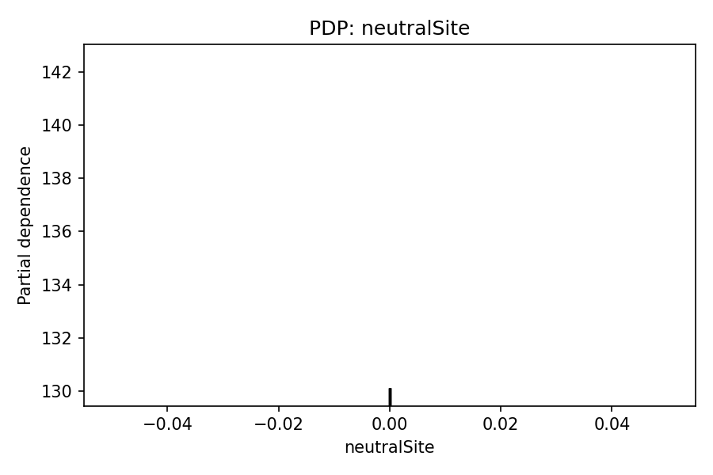
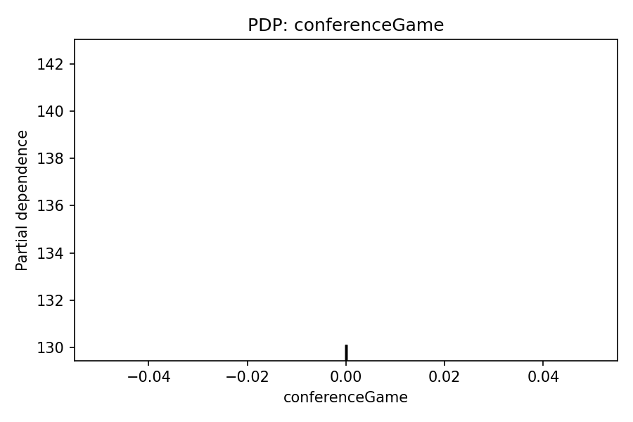
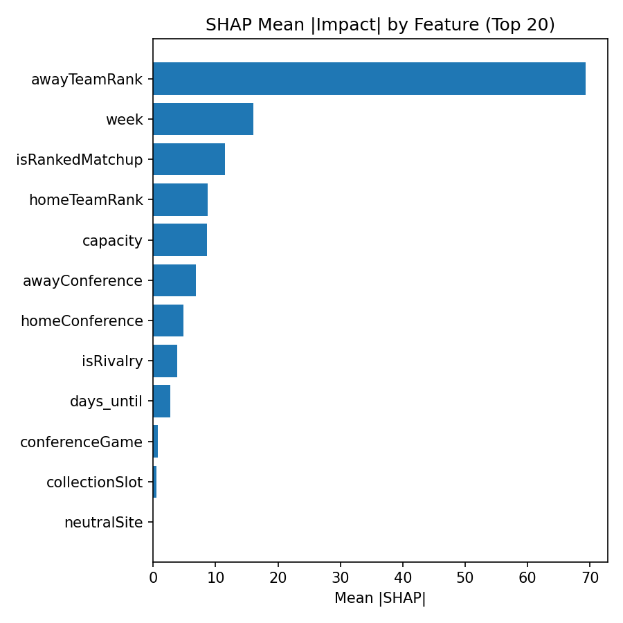
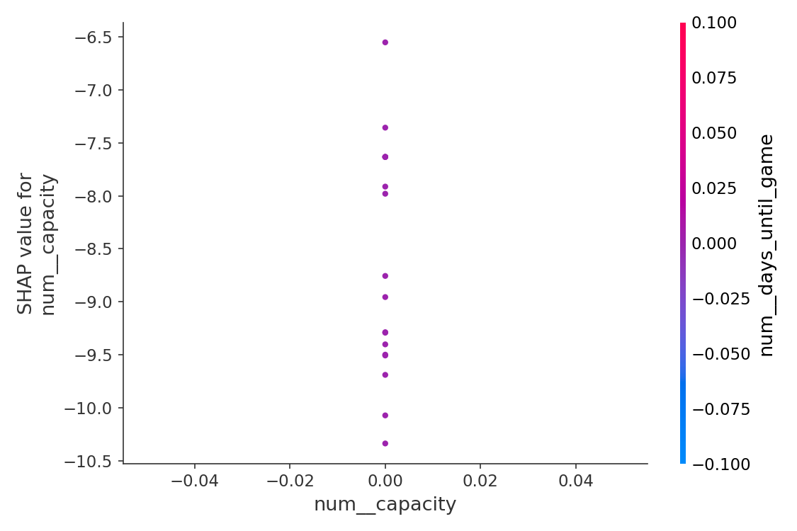

# 📈 Weekly Ticket Price Model Report
**Date:** 2025-09-01

## 🔍 Best Predictors of Ticket Price

### Top Transformed Features (expanded)
- isRankedMatchup was important, contributing 31.9% to predictions.
- awayTeamRank was important, contributing 15.2% to predictions.
- capacity was important, contributing 15.0% to predictions.
- week was important, contributing 8.2% to predictions.
- homeTeamRank was important, contributing 8.1% to predictions.
- days until game was important, contributing 6.9% to predictions.
- isRivalry was important, contributing 3.9% to predictions.
- Teams from the Big Ten awayconference mattered, contributing 1.9%.
- Teams from the Big 12 awayconference mattered, contributing 1.8%.
- Teams from the SEC awayconference mattered, contributing 1.5%.
- conferenceGame was important, contributing 1.0% to predictions.
- Teams from the ACC awayconference mattered, contributing 0.6%.
- Teams from the Big 12 homeconference mattered, contributing 0.5%.
- Teams from the SEC homeconference mattered, contributing 0.4%.
- Teams from the American Athletic homeconference mattered, contributing 0.3%.
- Teams from the Sun Belt homeconference mattered, contributing 0.3%.
- Teams from the ACC homeconference mattered, contributing 0.2%.
- Teams from the Big Ten homeconference mattered, contributing 0.2%.
- Teams from the Mid-American awayconference mattered, contributing 0.2%.
- Teams from the Mountain West awayconference mattered, contributing 0.2%.

### Aggregated by Original Column
- isRankedMatchup: 0.3189
- awayTeamRank: 0.1523
- capacity: 0.1497
- week: 0.0821
- homeTeamRank: 0.0811
- awayConference: 0.0710
- days_until: 0.0688
- isRivalry: 0.0392
- homeConference: 0.0237
- conferenceGame: 0.0102
- collectionSlot: 0.0023
- neutralSite: 0.0006

**Possibly unrelated (near-zero importance):** collectionSlot, neutralSite

## 🧪 Permutation Importance (recent data)

Top features by mean importance:

- days_until_game: 0.000000 (±0.000000)
- capacity: 0.000000 (±0.000000)
- neutralSite: 0.000000 (±0.000000)
- conferenceGame: 0.000000 (±0.000000)
- isRivalry: 0.000000 (±0.000000)
- isRankedMatchup: 0.000000 (±0.000000)
- homeTeamRank: 0.000000 (±0.000000)
- awayTeamRank: 0.000000 (±0.000000)
- week: 0.000000 (±0.000000)
- collectionSlot: 0.000000 (±0.000000)
- homeConference: -0.012238 (±0.019602)
- awayConference: -0.024991 (±0.015466)

_Saved full table → `data/permutation_importance_2025-09-01.csv`_

## 📈 Partial Dependence (Top Perm-Important)

## 🧮 SHAP Diagnostics (Top Perm-Important)

- Aggregated mean |SHAP| table: `data/shap_2025-09-01_mean_abs_by_feature_2025-09-01.csv`

## 📊 Model Accuracy (Past 7 Days)

- Games evaluated: **18**
- MAE: **$10.07**
- RMSE: **$26.74**
- Games > 5% error: **14 / 18**

## 🎯 Predicted vs Actual Prices

| Game | Date (ET) | Predicted | Actual | Abs Error | % Error |
|------|-----------|-----------|--------|-----------|---------|
|  vs  | 2025-08-28 | $19.58 | $129.00 | $109.42 | 84.8% |
|  vs  | 2025-08-28 | $81.53 | $106.00 | $24.47 | 23.1% |
|  vs  | 2025-08-28 | $24.47 | $13.00 | $11.47 | 88.2% |
|  vs  | 2025-08-28 | $64.00 | $55.00 | $9.00 | 16.4% |
|  vs  | 2025-08-28 | $16.88 | $12.00 | $4.88 | 40.7% |
|  vs  | 2025-08-28 | $21.16 | $17.00 | $4.16 | 24.5% |
|  vs  | 2025-08-28 | $21.16 | $25.00 | $3.84 | 15.4% |
|  vs  | 2025-08-28 | $17.12 | $20.00 | $2.88 | 14.4% |
|  vs  | 2025-08-28 | $28.76 | $26.00 | $2.76 | 10.6% |
|  vs  | 2025-08-28 | $27.29 | $25.00 | $2.29 | 9.2% |
|  vs  | 2025-08-28 | $21.77 | $20.00 | $1.77 | 8.8% |
|  vs  | 2025-08-28 | $5.25 | $4.00 | $1.25 | 31.2% |
|  vs  | 2025-08-28 | $16.05 | $15.00 | $1.05 | 7.0% |
|  vs  | 2025-08-28 | $16.12 | $17.00 | $0.88 | 5.2% |
|  vs  | 2025-08-28 | $13.49 | $13.00 | $0.49 | 3.8% |
|  vs  | 2025-08-28 | $12.62 | $13.00 | $0.38 | 2.9% |
|  vs  | 2025-08-28 | $6.21 | $6.00 | $0.21 | 3.5% |
|  vs  | 2025-08-28 | $11.14 | $11.00 | $0.14 | 1.3% |

## 💡 Suggestions
- Miss rate >40% this week; consider revisiting hyperparameters or adding interaction features.
- Consider adding: team momentum (last 2–3 games), previous-week result diff, rivalry strength score, and weather (temp/precip).
- Explore time-of-day effects more granularly (hour buckets) and weekday/weekend splits.
- Check stadium capacity normalization (capacity vs. sold % if/when available).

- Near-zero importance this week (may be unrelated): collectionSlot, neutralSite