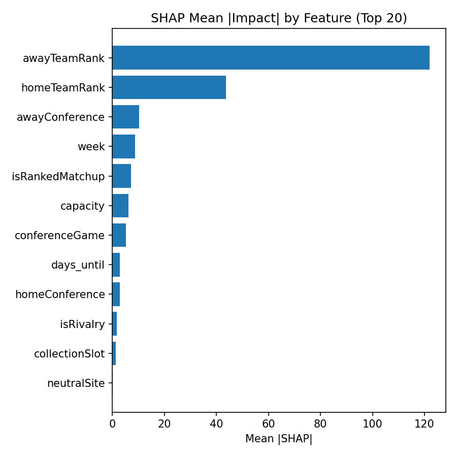
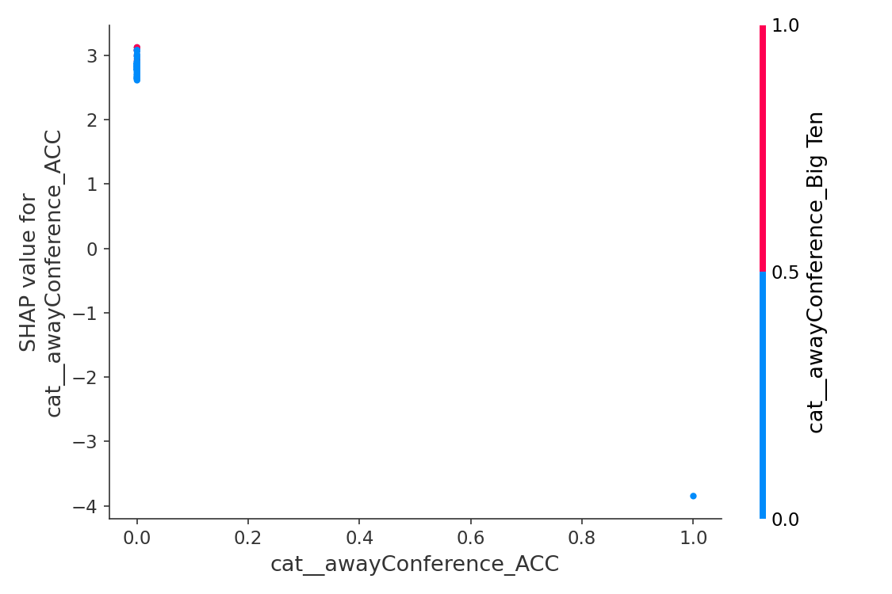
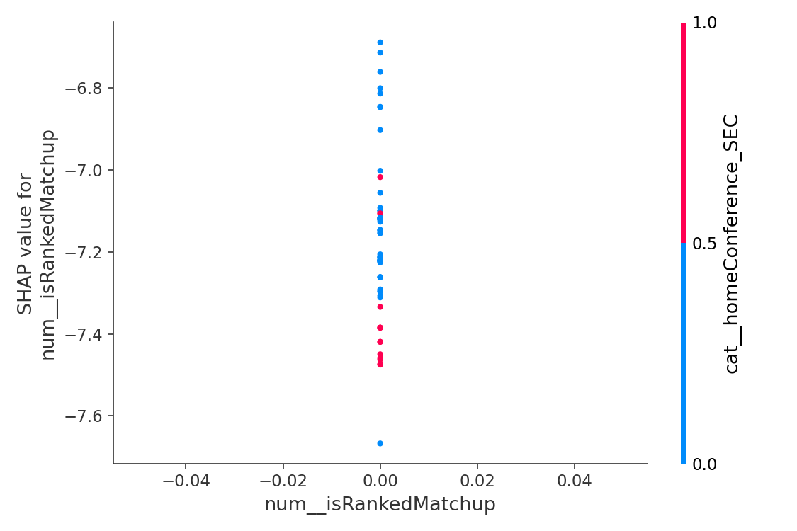
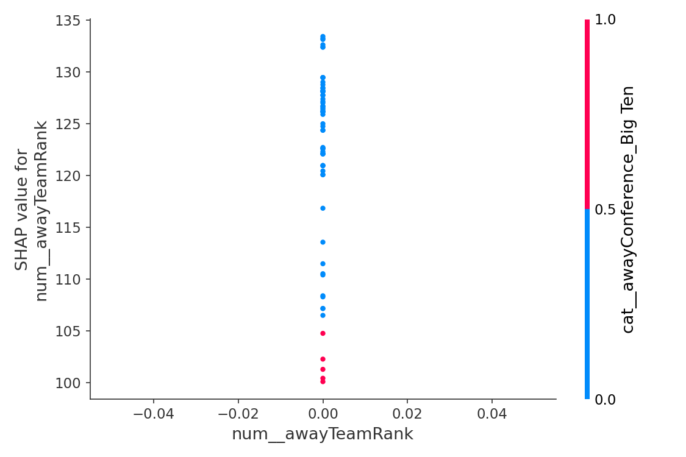
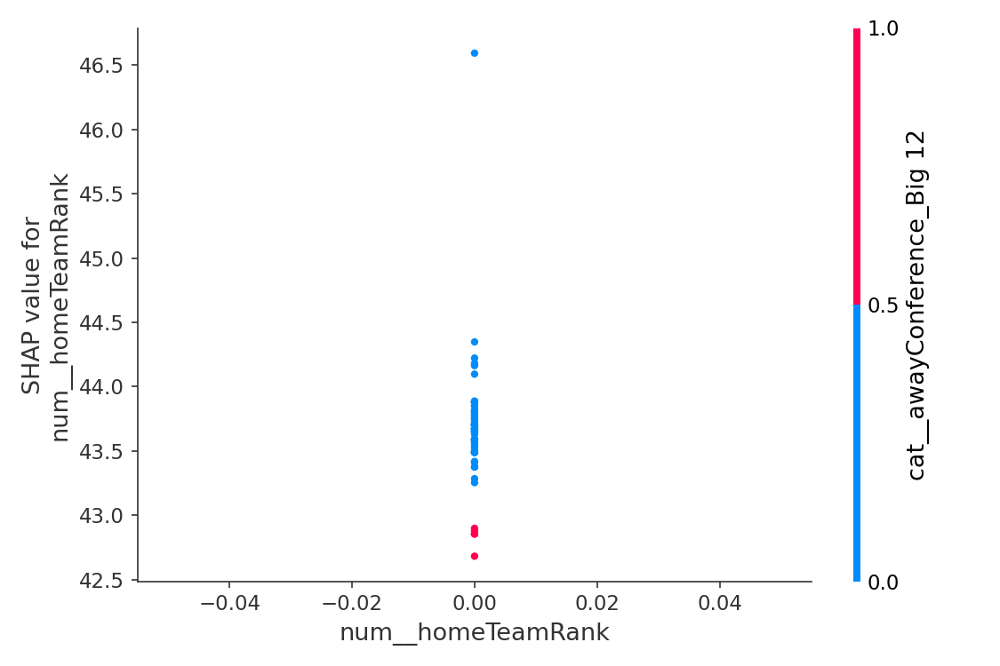

# 📈 Weekly Ticket Price Model Report
**Date:** 2025-09-06

## 🔍 Best Predictors of Ticket Price

### Top Transformed Features (expanded)
- days until game was important, contributing 25.2% to predictions.
- isRankedMatchup was important, contributing 24.7% to predictions.
- capacity was important, contributing 14.4% to predictions.
- awayTeamRank was important, contributing 10.6% to predictions.
- week was important, contributing 7.7% to predictions.
- homeTeamRank was important, contributing 5.3% to predictions.
- isRivalry was important, contributing 2.9% to predictions.
- Teams from the Big Ten awayconference mattered, contributing 1.3%.
- Teams from the SEC awayconference mattered, contributing 1.2%.
- Teams from the Big 12 awayconference mattered, contributing 1.1%.
- conferenceGame was important, contributing 0.9% to predictions.
- Teams from the SEC homeconference mattered, contributing 0.7%.
- Teams from the ACC awayconference mattered, contributing 0.6%.
- neutralSite was important, contributing 0.4% to predictions.
- Teams from the Big 12 homeconference mattered, contributing 0.4%.
- Teams from the American Athletic homeconference mattered, contributing 0.3%.
- Teams from the Mountain West awayconference mattered, contributing 0.3%.
- Teams from the ACC homeconference mattered, contributing 0.2%.
- Teams from the Sun Belt homeconference mattered, contributing 0.2%.
- Teams from the Big Ten homeconference mattered, contributing 0.2%.

### Aggregated by Original Column
- days_until: 0.2521
- isRankedMatchup: 0.2465
- capacity: 0.1444
- awayTeamRank: 0.1061
- week: 0.0768
- homeTeamRank: 0.0534
- awayConference: 0.0524
- isRivalry: 0.0292
- homeConference: 0.0227
- conferenceGame: 0.0089
- neutralSite: 0.0044
- collectionSlot: 0.0030

**Possibly unrelated (near-zero importance):** conferenceGame, neutralSite, collectionSlot

## 🧪 Permutation Importance (recent data)

Top features by mean importance:

- awayConference: 0.016886 (±0.018295)
- days_until_game: 0.000000 (±0.000000)
- isRankedMatchup: 0.000000 (±0.000000)
- awayTeamRank: 0.000000 (±0.000000)
- collectionSlot: 0.000000 (±0.000000)
- homeTeamRank: 0.000000 (±0.000000)
- capacity: -0.000000 (±0.000000)
- neutralSite: -0.000000 (±0.000000)
- conferenceGame: -0.000000 (±0.000000)
- isRivalry: -0.000000 (±0.000000)
- week: -0.000000 (±0.000000)
- homeConference: -0.016352 (±0.007652)

_Saved full table → `data/permutation_importance_2025-09-06.csv`_

## 📈 Partial Dependence (Top Perm-Important)

## 🧮 SHAP Diagnostics (Top Perm-Important)

- Aggregated mean |SHAP| table: `data/shap_2025-09-06_mean_abs_by_feature_2025-09-06.csv`

## 📊 Model Accuracy (Past 7 Days)

- Games evaluated: **67**
- MAE (price): **$5.24**
- RMSE (price): **$9.44**
- Games > 5% price error: **42 / 67**

### ⏱️ Timing Accuracy (Predicted Optimal vs Actual Lowest)
- MAE (hours): **78.08 h**  •  Median |Δ|: **16.73 h**
- Within 6h: **27/67**  •  Within 12h: **29/67**  •  Within 24h: **41/67**
- Bias: predictions are on average **60.95 h earlier than** actual lows

## 🎯 Predicted vs Actual Prices & Timing

| Game | Date (ET) | Pred $ | Actual $ | Abs $ | % Err | Pred Opt (ET) | Actual Low (ET) | Abs Δ (h) |
|------|--------------------|--------|----------|-------|-------|----------------------|-------------------------|-----------|
| Oklahoma Sooners vs Michigan Wolverine | 2025-09-06 | $240.45 | $207.00 | $33.45 | 16.2% | 2025-09-05 18:00 | 2025-09-06 12:00 | 18.00 |
| Texas Longhorns vs San Jose State Spartan | 2025-09-06 | $56.72 | $28.00 | $28.72 | 102.6% | 2025-08-30 18:00 | 2025-09-06 06:00 | 156.00 |
| Ohio Bobcats vs West Virginia Mountaineer | 2025-09-06 | $87.14 | $62.00 | $25.14 | 40.5% | 2025-09-05 18:00 | 2025-09-06 06:00 | 12.00 |
| Temple Owls vs Howard Bison | 2025-09-06 | $29.47 | $6.00 | $23.47 | 391.2% | 2025-08-25 18:00 | 2025-09-05 10:43 | 256.73 |
| Kansas State Wildcats vs Army West Point Black Knight | 2025-09-06 | $52.83 | $30.00 | $22.83 | 76.1% | 2025-09-05 00:00 | 2025-09-05 18:00 | 18.00 |
| Maryland Terrapins vs Northern Illinois Huskie | 2025-09-06 | $26.35 | $4.00 | $22.35 | 558.8% | 2025-09-05 12:00 | 2025-09-05 12:00 | 0.00 |
| Appalachian State Mountaineers vs Lindenwood Lion | 2025-09-06 | $102.23 | $81.00 | $21.23 | 26.2% | 2025-08-23 12:00 | 2025-09-06 12:00 | 336.00 |
| Tennessee Volunteers vs East Tennessee State Buccaneer | 2025-09-06 | $60.28 | $42.00 | $18.28 | 43.5% | 2025-09-05 18:00 | 2025-09-06 00:00 | 6.00 |
| Arkansas Razorbacks vs Arkansas State Red Wolve | 2025-09-06 | $67.09 | $52.00 | $15.09 | 29.0% | 2025-08-25 12:00 | 2025-09-06 06:00 | 282.00 |
| Ohio State Buckeyes vs Grambling State Tiger | 2025-09-06 | $22.05 | $35.00 | $12.95 | 37.0% | 2025-08-31 06:00 | 2025-09-05 10:43 | 124.73 |
| Missouri Tigers vs Kansas Jayhawk | 2025-09-06 | $196.84 | $186.00 | $10.84 | 5.8% | 2025-09-05 12:00 | 2025-09-06 12:00 | 24.00 |
| Northwestern Wildcats vs Western Illinois Leatherneck | 2025-09-05 | $30.20 | $40.00 | $9.80 | 24.5% | 2025-09-04 18:00 | 2025-09-05 10:43 | 16.73 |
| Hawaii Rainbow Warriors vs Sam Houston State Bearkat | 2025-09-06 | $31.47 | $24.00 | $7.47 | 31.1% | 2025-09-05 12:00 | 2025-09-06 00:00 | 12.00 |
| Southern Methodist (SMU) Mustangs vs Baylor Bear | 2025-09-06 | $55.66 | $49.00 | $6.66 | 13.6% | 2025-08-10 18:00 | 2025-09-06 06:00 | 636.00 |
| South Alabama Jaguars vs Tulane Green Wave | 2025-09-06 | $26.16 | $20.00 | $6.16 | 30.8% | 2025-09-05 18:00 | 2025-09-06 12:00 | 18.00 |
| Iowa State Cyclones vs Iowa Hawkeye | 2025-09-06 | $108.80 | $103.00 | $5.80 | 5.6% | 2025-08-29 12:00 | 2025-08-29 12:00 | 0.00 |
| Nebraska Cornhuskers vs Akron Zip | 2025-09-06 | $47.76 | $42.00 | $5.76 | 13.7% | 2025-08-28 18:00 | 2025-08-28 18:00 | 0.00 |
| Ohio State Buckeyes vs Grambling State Tiger | 2025-09-06 | $11.36 | $17.00 | $5.64 | 33.2% | 2025-09-05 18:00 | 2025-09-05 12:00 | 6.00 |
| Alabama Crimson Tide vs Louisiana Monroe Warhawk | 2025-09-06 | $11.29 | $6.00 | $5.29 | 88.2% | 2025-09-01 00:00 | 2025-09-06 12:00 | 132.00 |
| Clemson Tigers vs Troy Trojan | 2025-09-06 | $12.23 | $7.00 | $5.23 | 74.7% | 2025-08-22 18:00 | 2025-09-06 12:00 | 354.00 |
| Georgia Bulldogs vs Austin Peay Governor | 2025-09-06 | $36.21 | $32.00 | $4.21 | 13.2% | 2025-09-04 06:00 | 2025-09-06 12:00 | 54.00 |
| Duke Blue Devils vs Illinois Fighting Illini | 2025-09-06 | $21.25 | $18.00 | $3.25 | 18.1% | 2025-09-03 12:00 | 2025-09-05 10:43 | 46.73 |
| Texas Tech Red Raiders vs Kent State Golden Flashe | 2025-09-06 | $6.25 | $3.00 | $3.25 | 108.3% | 2025-08-27 12:00 | 2025-09-06 00:00 | 228.00 |
| Auburn Tigers vs Ball State Cardinal | 2025-09-06 | $17.17 | $14.00 | $3.17 | 22.6% | 2025-08-31 06:00 | 2025-09-01 12:00 | 30.00 |
| Colorado Buffaloes vs Delaware Blue Hen | 2025-09-06 | $32.09 | $29.00 | $3.09 | 10.7% | 2025-09-05 12:00 | 2025-09-06 00:00 | 12.00 |
| Rutgers Scarlet Knights vs Miami (OH) RedHawk | 2025-09-06 | $17.09 | $14.00 | $3.09 | 22.1% | 2025-09-05 12:00 | 2025-09-06 00:00 | 12.00 |
| Rice Owls vs Houston Cougar | 2025-09-06 | $39.00 | $36.00 | $3.00 | 8.3% | 2025-09-02 00:00 | 2025-09-01 12:00 | 12.00 |
| Navy Midshipmen vs UAB Blazer | 2025-09-06 | $17.98 | $15.00 | $2.98 | 19.9% | 2025-08-29 18:00 | 2025-09-06 12:00 | 186.00 |
| Western Michigan Broncos vs North Texas Mean Green | 2025-09-06 | $17.93 | $15.00 | $2.93 | 19.5% | 2025-08-30 18:00 | 2025-08-24 01:06 | 160.90 |
| Texas A&M Aggies vs Utah State Aggie | 2025-09-06 | $18.87 | $16.00 | $2.87 | 17.9% | 2025-09-05 12:00 | 2025-09-05 18:00 | 6.00 |
| Colorado State vs Northern Colorado Bear | 2025-09-06 | $26.35 | $29.00 | $2.65 | 9.1% | 2025-09-05 12:00 | 2025-08-31 12:00 | 120.00 |
| Oregon Ducks vs Oklahoma State Cowboy | 2025-09-06 | $22.13 | $20.00 | $2.13 | 10.6% | 2025-08-07 12:00 | 2025-09-05 18:00 | 702.00 |
| Florida State Seminoles vs East Texas A&M Lion | 2025-09-06 | $8.72 | $7.00 | $1.72 | 24.6% | 2025-08-29 12:00 | 2025-08-29 12:00 | 0.00 |
| UTSA Roadrunners vs Texas State Bobcat | 2025-09-06 | $28.54 | $27.00 | $1.54 | 5.7% | 2025-09-05 06:00 | 2025-08-28 06:00 | 192.00 |
| Kentucky Wildcats vs Mississippi Rebel | 2025-09-06 | $41.49 | $40.00 | $1.49 | 3.7% | 2025-09-05 18:00 | 2025-09-05 18:00 | 0.00 |
| Florida Gators vs South Florida Bull | 2025-09-06 | $53.45 | $52.00 | $1.45 | 2.8% | 2025-08-22 12:00 | 2025-08-24 01:06 | 37.10 |
| Southern Miss Golden Eagles vs Jackson State Tiger | 2025-09-06 | $39.40 | $38.00 | $1.40 | 3.7% | 2025-09-05 18:00 | 2025-09-05 18:00 | 0.00 |
| Nevada Wolf Pack vs Sacramento State Hornet | 2025-09-06 | $12.25 | $11.00 | $1.25 | 11.4% | 2025-08-27 06:00 | 2025-08-28 06:00 | 24.00 |
| USC Trojans vs Georgia Southern Eagle | 2025-09-06 | $12.22 | $11.00 | $1.22 | 11.1% | 2025-08-27 12:00 | 2025-09-06 12:00 | 240.00 |
| UNLV Rebels vs UCLA Bruin | 2025-09-06 | $54.18 | $53.00 | $1.18 | 2.2% | 2025-09-02 06:00 | 2025-09-01 12:00 | 18.00 |
| Utah Utes vs Cal Poly Mustang | 2025-09-06 | $43.08 | $42.00 | $1.08 | 2.6% | 2025-08-27 18:00 | 2025-08-29 18:00 | 48.00 |
| Indiana Hoosiers vs Kennesaw State Owl | 2025-09-06 | $15.90 | $15.00 | $0.90 | 6.0% | 2025-09-05 12:00 | 2025-09-05 10:43 | 1.27 |
| Florida Atlantic Owls vs Florida A&M Rattler | 2025-09-06 | $10.89 | $10.00 | $0.89 | 8.9% | 2025-08-30 18:00 | 2025-09-05 18:00 | 144.00 |
| Marshall Thundering Herd vs Missouri State Bear | 2025-09-06 | $9.87 | $9.00 | $0.87 | 9.7% | 2025-08-29 18:00 | 2025-08-29 18:00 | 0.00 |
| Oregon State Beavers vs Fresno State Bulldog | 2025-09-06 | $11.78 | $11.00 | $0.78 | 7.1% | 2025-09-05 18:00 | 2025-09-05 18:00 | 0.00 |
| LSU Tigers vs Louisiana Tech Bulldog | 2025-09-06 | $16.77 | $16.00 | $0.77 | 4.8% | 2025-08-25 12:00 | 2025-08-24 01:06 | 34.90 |
| Old Dominion Monarchs vs North Carolina Central Eagle | 2025-09-06 | $17.65 | $17.00 | $0.65 | 3.8% | 2025-08-30 06:00 | 2025-08-30 06:00 | 0.00 |
| New Mexico Lobos vs Idaho State Bengal | 2025-09-06 | $17.59 | $17.00 | $0.59 | 3.5% | 2025-08-26 00:00 | 2025-09-01 12:00 | 156.00 |
| Wyoming Cowboys vs Northern Iowa Panther | 2025-09-06 | $26.55 | $26.00 | $0.55 | 2.1% | 2025-08-27 12:00 | 2025-08-27 14:44 | 2.75 |
| Buffalo Bulls vs Saint Francis (PA) Red Flash | 2025-09-06 | $16.55 | $16.00 | $0.55 | 3.4% | 2025-09-05 18:00 | 2025-09-05 18:00 | 0.00 |
| Jacksonville State Gamecocks vs Liberty Flame | 2025-09-06 | $19.47 | $20.00 | $0.53 | 2.6% | 2025-08-30 18:00 | 2025-08-30 18:00 | 0.00 |
| Boise State Broncos vs Eastern Washington Eagle | 2025-09-05 | $36.54 | $37.00 | $0.46 | 1.2% | 2025-08-25 00:00 | 2025-08-24 01:06 | 22.90 |
| East Carolina Pirates vs Campbell Fighting Camel | 2025-09-06 | $17.45 | $17.00 | $0.45 | 2.6% | 2025-08-28 18:00 | 2025-08-28 18:00 | 0.00 |
| Penn State Nittany Lions vs Florida International Panther | 2025-09-06 | $6.38 | $6.00 | $0.38 | 6.3% | 2025-08-30 12:00 | 2025-08-30 12:00 | 0.00 |
| Minnesota Golden Gophers vs Northwestern State Demon | 2025-09-06 | $13.35 | $13.00 | $0.35 | 2.7% | 2025-08-27 12:00 | 2025-08-27 14:44 | 2.75 |
| Syracuse Orange vs UConn Huskie | 2025-09-06 | $3.31 | $3.00 | $0.31 | 10.3% | 2025-08-29 00:00 | 2025-08-29 00:00 | 0.00 |
| Wake Forest Demon Deacons vs Western Carolina Catamount | 2025-09-06 | $6.70 | $7.00 | $0.30 | 4.3% | 2025-08-16 06:00 | 2025-08-27 14:44 | 272.75 |
| Georgia Tech Yellow Jackets vs Gardner-Webb Runnin' Bulldog | 2025-09-06 | $6.25 | $6.00 | $0.25 | 4.2% | 2025-08-27 12:00 | 2025-08-27 14:44 | 2.75 |
| California Golden Bears vs Texas Southern Tiger | 2025-09-06 | $19.23 | $19.00 | $0.23 | 1.2% | 2025-08-27 12:00 | 2025-08-27 14:11 | 2.19 |
| Mississippi State Bulldogs vs Arizona State Sun Devil | 2025-09-06 | $13.12 | $13.00 | $0.12 | 0.9% | 2025-08-28 18:00 | 2025-08-28 18:00 | 0.00 |
| Wisconsin Badgers vs Middle Tennessee Blue Raider | 2025-09-06 | $7.09 | $7.00 | $0.09 | 1.3% | 2025-08-27 12:00 | 2025-08-27 14:44 | 2.75 |
| Cincinnati Bearcats vs Bowling Green State Falcon | 2025-09-06 | $34.05 | $34.00 | $0.05 | 0.1% | 2025-08-26 18:00 | 2025-08-27 14:44 | 20.75 |
| North Carolina State Wolfpack vs Virginia Cavalier | 2025-09-06 | $19.97 | $20.00 | $0.03 | 0.1% | 2025-09-05 12:00 | 2025-09-05 12:00 | 0.00 |
| Louisville Cardinals vs James Madison Duke | 2025-09-05 | $5.97 | $6.00 | $0.03 | 0.5% | 2025-08-31 18:00 | 2025-08-31 12:00 | 6.00 |
| UMass Minutemen vs Bryant Bulldog | 2025-09-06 | $12.03 | $12.00 | $0.03 | 0.2% | 2025-09-05 18:00 | 2025-09-05 18:00 | 0.00 |
| Maryland Terrapins vs Northern Illinois Huskie | 2025-09-05 | $2.00 | $2.00 | $0.00 | 0.0% | 2025-09-04 12:00 | 2025-09-05 10:43 | 22.73 |
| Pittsburgh Panthers vs Central Michigan Chippewa | 2025-09-06 | $3.00 | $3.00 | $0.00 | 0.0% | 2025-09-01 06:00 | 2025-09-01 06:00 | 0.00 |

## 💡 Suggestions
- Miss rate >40% this week; consider revisiting hyperparameters or adding interaction features.
- Consider adding: team momentum (last 2–3 games), previous-week result diff, rivalry strength score, and weather (temp/precip).
- Explore time-of-day effects more granularly (hour buckets) and weekday/weekend splits.
- Check stadium capacity normalization (capacity vs. sold % if/when available).
- Timing: 15% of predictions occur *after* the actual low — consider features about pre-game demand decay and listing churn.
- Near-zero importance this week (may be unrelated): collectionSlot, conferenceGame, neutralSite